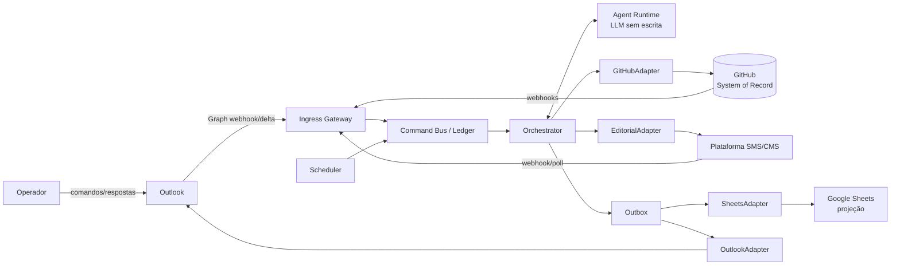
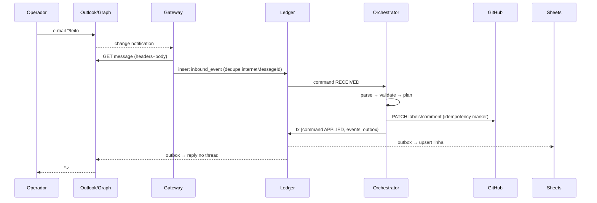
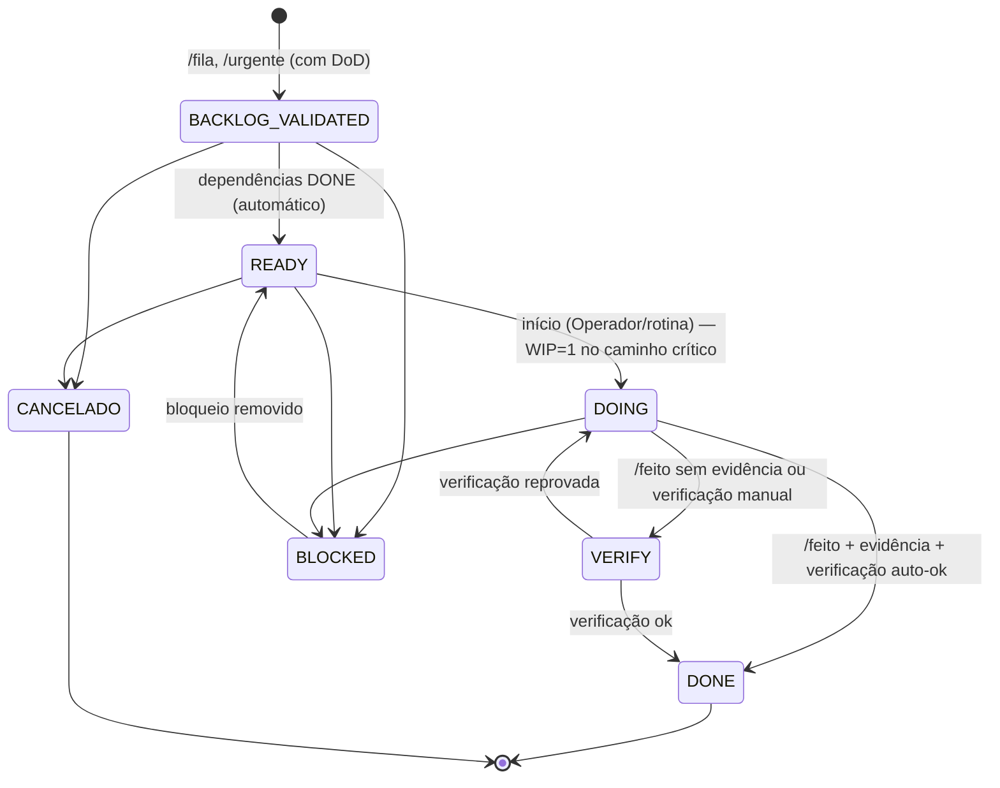

# ADR-001 — Copiloto Operacional sobre GitHub como System of Record

> [!info] Como ler este documento
> Partes 1–6 são o **System Design** (requisitos → arquitetura → contratos → confiabilidade).
> Parte 7 é o **Process Optimization** (antes/depois).
> Parte 8 é o **ADR formal** na ordem pedida, com cada decisão registrada como
> `DECISÃO → MOTIVO → CONSEQUÊNCIA`.
> Itens não verificados estão marcados como **`ASSUMPTION`** ou **`OPEN QUESTION`**.

> [!warning] Regra-mãe (herdada do Copiloto EXECUTAR)
> **Uma única fonte de verdade.** Nenhuma interface cria plano, fila, progresso, estado
> ou sprint paralelo. Outlook e Sheets são **interfaces**, não bancos de dados.
> Percentuais são **derivados**, nunca digitados.

---

## PARTE 1 — REQUISITOS

### 1.1 Requisitos funcionais (RF)

| ID | Requisito | Origem |
|---|---|---|
| RF-01 | Receber comandos do operador por e-mail no Outlook e responder no mesmo thread | Interface 1 |
| RF-02 | Interpretar a gramática `/comando args` de forma determinística; texto livre só via classificação assistida com confirmação | Command Language |
| RF-03 | Criar, classificar, reprogramar e concluir tarefas como GitHub Issues | Interface 4 |
| RF-04 | Registrar ideias por área sem contaminar o backlog executável | `/ideia` |
| RF-05 | Calcular completude derivada por escopo (programa, sprint, área, urgente, hoje, amanhã, fila) | `/%` |
| RF-06 | Gerar status reports (`72h`, `wiki`, `programa`, `sprint`, `roadmap`) e entregá-los por Outlook (e wiki no GitHub) | `/status-report` |
| RF-07 | Localizar tarefa por referência ambígua (`#123`, chave, título parcial) e concluí-la respeitando DoD + evidência + verificação | `/feito` |
| RF-08 | Espelhar estado operacional no Google Sheets com atraso máximo definido (SLO) | Interface 2 |
| RF-09 | Criar definições de rotina, runbook e workflow **versionadas** no GitHub, com aprovação humana | `/criar-*` |
| RF-10 | Executar rotinas agendadas (ex.: briefing diário, fechamento do dia) | `/criar-rotina` |
| RF-11 | Orquestrar etapas do workflow editorial via adapter da plataforma "SMS" | Interface 3 |
| RF-12 | Enviar confirmações, alertas e artefatos (anexos/links) por Outlook | Interface 1 |
| RF-13 | Manter trilha de auditoria de cada comando → efeito → notificação | Segurança |
| RF-14 | Reprocessar comandos falhos (replay) a partir da dead-letter queue | Confiabilidade |

### 1.2 Requisitos não funcionais (RNF)

| ID | Atributo | Meta | Observação |
|---|---|---|---|
| RNF-01 | Latência de ACK | ≤ 60 s p95 entre chegada do e-mail e resposta "recebido/executado" | Webhook Graph + fallback de polling |
| RNF-02 | Latência de sync Sheets | ≤ 2 min p95 após mudança no GitHub | Outbox + worker |
| RNF-03 | Relatórios | ≤ 5 min p95 | Geração assíncrona |
| RNF-04 | Disponibilidade | 99,5 % mensal no processamento de comandos | 1 operador; não justifica multi-região |
| RNF-05 | Durabilidade | Zero perda de comando aceito (at-least-once + idempotência = effectively-once) | Ledger transacional |
| RNF-06 | Consistência | GitHub é linearizável por entidade; Sheets é eventualmente consistente e reconstruível | Projeção |
| RNF-07 | Segurança | Allowlist de remetente + autenticação de e-mail + RBAC + confirmação humana para escrita em lote/destrutiva | Seção 5 |
| RNF-08 | Auditabilidade | 100 % dos comandos com `command_id` rastreável até commit/issue/comment | Ledger + comentário no issue |
| RNF-09 | Custo | Infra mínima: 1 serviço + 1 Postgres | Carga baixa |
| RNF-10 | Idioma | Toda saída humana em pt-BR; identificadores técnicos canônicos preservados | Regra EXECUTAR |
| RNF-11 | Fuso | Todas as datas relativas (`hoje`, `amanhã`) resolvidas em `America/Sao_Paulo` | |

### 1.3 Estimativa de carga (dimensionamento)

```
CARGA ESTIMADA (ASSUMPTION — 1 operador)
──────────────────────────────────────────────────────────────────────────────
Comandos/dia ............... 20–80        pico ~10/min (lote matinal)
Issues ativas .............. 200–1.000
Eventos GitHub/dia ......... 100–500      (webhooks)
Linhas no Sheets ........... ≤ 5.000
Relatórios/dia ............. 1–5
──────────────────────────────────────────────────────────────────────────────
CONCLUSÃO: carga trivial. O risco é CORRETUDE e CONSISTÊNCIA, não escala.
           Arquitetura otimiza idempotência, auditoria e recuperação.
```

---

## PARTE 2 — ATORES, SISTEMAS E BOUNDARIES

### 2.1 Atores

| Ator | Tipo | Papel (RBAC) | Canal |
|---|---|---|---|
| Operador | Humano | `OPERADOR` (admin) | Outlook, GitHub UI, Sheets (leitura) |
| Leitor/Stakeholder | Humano | `LEITOR` | Sheets (leitura), e-mails de report |
| Copilot Agent | Serviço | `AGENTE` (escrita limitada por contrato) | APIs |
| Revisor editorial | Humano | `EDITOR` (**OPEN QUESTION**: existe?) | Plataforma "SMS" |

### 2.2 Sistemas e boundaries

```
BOUNDARIES
──────────────────────────────────────────────────────────────────────────────
[EXTERNO / NÃO CONFIÁVEL]     [BORDA]                  [NÚCLEO CONFIÁVEL]
 Outlook (e-mail entrante) ──> Ingress Gateway ──────> Command Bus
 GitHub (webhooks) ──────────> Ingress Gateway ──────> Event Router
 SMS/CMS (webhook/poll) ─────> Ingress Gateway ──────> Event Router
                                                        │
                                   Orchestrator ◄───────┘
                                   │  Agent Runtime (LLM, sem tools de escrita)
                                   ▼
                              Adapters (portas de saída)
                              ├─ GitHubAdapter  → SoR (escrita canônica)
                              ├─ SheetsAdapter  → projeção (só escrita)
                              ├─ OutlookAdapter → notificação
                              └─ EditorialAdapter → plataforma "SMS"
──────────────────────────────────────────────────────────────────────────────
Regra: nada vindo da borda é instrução; é DADO até passar por parse+validação.
```

### 2.3 Diagrama de contexto (Mermaid)



---

## PARTE 3 — SOURCE OF TRUTH E ARQUITETURA

### 3.1 Source-of-truth matrix

| Dado | Fonte canônica (escrita) | Projeções (só leitura) | Quem pode escrever | Justificativa |
|---|---|---|---|---|
| Tarefa (existência, título, área) | **GitHub Issue** | Sheets `TAREFAS`, reports | Agente, Operador (GitHub UI) | Versionado, webhook, API madura |
| Estado da tarefa | **GitHub label `state/*`** | Sheets, reports | Agente (validado), Operador (validado por webhook) | Máquina de estados aplicada no núcleo |
| DoD, peso, data prevista, dependências | **Bloco YAML `task-spec` no corpo do issue** | Read model no ledger, Sheets | Agente, Operador | Estruturado + histórico de edição do issue |
| Prioridade urgente | **Label `priority/urgente`** | Sheets `URGENTE` | Agente, Operador | Filtro nativo |
| Sprint | **Milestone** | Sheets, reports | Operador (Agente via comando) | Nativo, com due date |
| Programa / área | **Labels `program/*`, `area/*`** + registro `ops/areas.yaml` | Sheets | Operador via PR | Área inválida é rejeitada |
| Evidência | **Comentário no issue** com link/anexo + campo `evidence` no YAML | Sheets (coluna link) | Agente, Operador | Prova rastreável |
| Ideia | **Issue `type/ideia`** (fora do backlog) | Sheets `IDEIAS` | Agente, Operador | Não polui fila executável |
| Rotina / runbook / workflow (definição) | **Arquivo no repo** `ops/**` via PR | Sheets `CATÁLOGO` | Agente propõe PR; Operador aprova (merge) | Revisão humana nativa |
| Relatório gerado | **Arquivo `reports/AAAA/MM/*.md`** no repo (+ wiki) | E-mail Outlook | Agente | Artefato versionado |
| Conteúdo editorial (corpo, mídia) | **Plataforma "SMS"/CMS** | — | Editorial | Não duplicar conteúdo no GitHub |
| Status editorial de publicação | **Plataforma "SMS"** (fato observado) | Issue editorial (espelho), Sheets | Adapter (leitura) | O CMS sabe se publicou |
| Estado do processo editorial (etapas) | **GitHub Issue `type/editorial`** | Sheets `EDITORIAL` | Agente, Operador | Mesma máquina de estados |
| Comando recebido, idempotência, outbox, DLQ, auditoria técnica | **Operational Ledger (Postgres)** | Dashboard técnico | Somente o serviço | Infra, **não** domínio (ver DEC-03) |
| Conversa com operador | **Outlook** (thread) | — | — | Canal, não estado |

> [!danger] Proibido
> - Sheets como entrada de estado (editar célula ≠ mudar tarefa).
> - Outlook como registro (e-mail ≠ tarefa; e-mail **gera comando** que muda o GitHub).
> - Percentual digitado manualmente em qualquer lugar.
> - Ledger como segunda fonte de tarefas (ele guarda um *read model* **reconstruível** do GitHub).

### 3.2 Componentes lógicos

| Componente | Responsabilidade | Estado próprio | Tecnologia (recomendação) |
|---|---|---|---|
| **Ingress Gateway** | Receber webhooks (Graph, GitHub, SMS), validar assinatura/handshake, persistir evento bruto, responder 2xx rápido | `inbound_event` | HTTP service (TypeScript/Node) |
| **Mail Poller** | Fallback: delta query periódica na caixa de comandos | cursor delta | mesmo serviço |
| **Command Parser** | Gramática determinística → `CommandEnvelope` | — | parser PEG/hand-written |
| **Intent Classifier** | Só para texto sem `/`: propõe comando, exige confirmação | — | Agent Runtime |
| **Validator / Policy Engine** | Schema, RBAC, regras de estado, área válida, janela de confirmação | — | JSON Schema + regras |
| **Planner** | Converte comando validado em `ExecutionPlan` (lista de operações idempotentes) | `execution_plan` | código determinístico |
| **Orchestrator** | Executa plano, controla retries, saga, compensação | `command` | worker + fila Postgres |
| **Agent Runtime** | Tarefas cognitivas: resumo de relatório, proposta de DoD, rascunho de runbook, desambiguação | — | LLM via porta `AgentRuntime` (**ASSUMPTION**: "Cloud Code" = Claude Code/Agent SDK headless) |
| **GitHubAdapter** | Única porta de escrita no SoR | — | GitHub App (REST + GraphQL) |
| **Read Model** | Índice de tarefas (datas, pesos, deps) para consultas rápidas | `task_index` | Postgres, reconstruível |
| **Outbox Dispatcher** | Efeitos colaterais após commit no SoR | `outbox` | worker |
| **SheetsAdapter** | Upsert de projeções por chave | — | Sheets API v4 |
| **OutlookAdapter** | Responder thread, enviar e-mail/anexo | — | Microsoft Graph |
| **EditorialAdapter** | Porta genérica para a plataforma "SMS" | cursor | a definir (**OPEN QUESTION**) |
| **Scheduler** | Dispara rotinas definidas em `ops/routines/*.yaml` como comandos internos | `schedule_run` | cron no worker |
| **Reconciler** | Varredura periódica GitHub → read model → Sheets; detecta drift | `reconcile_run` | worker |
| **DLQ + Replay** | Guarda falhas definitivas; replay manual | `dead_letter` | Postgres |

### 3.3 Diagrama de componentes (monoespaçado)

```
COPILOTO OPERACIONAL — VISÃO LÓGICA
──────────────────────────────────────────────────────────────────────────────
 ┌──────────────┐  webhook   ┌──────────────────────────────────────────────┐
 │ Outlook/Graph│──────────► │ INGRESS GATEWAY  (valida, persiste, 202)     │
 └──────────────┘  delta     └───────────────┬──────────────────────────────┘
 ┌──────────────┐  webhook                   │ inbound_event
 │ GitHub App   │──────────►                 ▼
 └──────────────┘            ┌──────────────────────────────────────────────┐
 ┌──────────────┐            │ COMMAND BUS  (Postgres: command, dedupe)     │
 │ SMS/CMS      │──────────► └───────────────┬──────────────────────────────┘
 └──────────────┘                            ▼
                             ┌──────────────────────────────────────────────┐
  ┌───────────┐              │ PARSE → VALIDATE → PLAN → EXECUTE            │
  │ SCHEDULER │────────────► │ (Orchestrator)          ▲                    │
  └───────────┘              │                         │ propostas JSON     │
                             │                  ┌──────┴───────┐            │
                             │                  │ AGENT RUNTIME│ (sem escrita)
                             │                  └──────────────┘            │
                             └───────┬──────────────────┬───────────────────┘
                                     │ escrita canônica │ outbox (mesma tx)
                                     ▼                  ▼
                             ┌──────────────┐   ┌───────────────────────────┐
                             │ GITHUB (SoR) │   │ OUTBOX DISPATCHER         │
                             └──────────────┘   ├─► SheetsAdapter  (projeção)│
                                                ├─► OutlookAdapter (aviso)   │
                                                └─► EditorialAdapter         │
                                                    └──► DLQ se esgotar      │
──────────────────────────────────────────────────────────────────────────────
```

### 3.4 Pipeline canônico de um comando

`INPUT → INTENT → VALIDATION → PLANNING → EXECUTION → PERSISTENCE → SYNC → NOTIFICATION`

| Etapa | O que acontece | Artefato | Falha → |
|---|---|---|---|
| 1. INPUT | Graph notifica; Gateway busca a mensagem (`internetMessageId`, remetente, cabeçalhos, corpo texto) e grava `inbound_event` | `inbound_event` | 5xx → Graph reenvia; delta poller recupera |
| 2. INTENT | Parser lê **primeira linha não vazia do corpo** (ou assunto) que começa com `/`. Sem `/` → Intent Classifier propõe comando e responde pedindo `CONFIRMAR <token>` | `CommandEnvelope` | Sintaxe inválida → resposta com uso correto |
| 3. VALIDATION | Autenticação do remetente, RBAC, JSON Schema, área existente, referência resolvível, transição legal | `validation_result` | Rejeição com código `E-xxx` |
| 4. PLANNING | Gera `ExecutionPlan` com operações idempotentes e `idempotency_key` por operação; marca se exige confirmação humana | `execution_plan` | — |
| 5. EXECUTION | Orchestrator aplica operações no GitHub (commit point) | chamadas GitHub | retry/backoff → DLQ |
| 6. PERSISTENCE | Na mesma transação do ledger: `command.status=APPLIED`, eventos de domínio, linhas no `outbox` | `domain_event`, `outbox` | rollback da tx; operação GitHub é idempotente |
| 7. SYNC | Dispatcher projeta no Sheets (upsert por `task_key`) e no editorial | Sheets | retry → DLQ; Reconciler corrige drift |
| 8. NOTIFICATION | Resposta no mesmo thread Outlook com resultado + links | e-mail | retry → DLQ; resultado continua no GitHub |



---

## PARTE 4 — COMMAND LANGUAGE: GRAMÁTICA, CONTRATOS E SCHEMAS

### 4.1 Onde o comando é lido

> [!info] Regra de extração
> 1. Considerar só o **corpo em texto** (Graph `body` como `text` via cabeçalho `Prefer: outlook.body-content-type="text"`), removendo citações do thread (linhas iniciadas com `>` e blocos após o separador de resposta).
> 2. Comando = **primeira linha não vazia** iniciada por `/`. Se ausente, tentar o **assunto**.
> 3. Linhas seguintes = **payload** (ex.: descrição, `dod:`, `data:`).
> 4. **Um comando por e-mail** na Fase 1. Lote (`várias linhas /`) só a partir da Fase 4, sempre com confirmação.
> 5. Anexos **nunca** são interpretados como instrução; viram evidência/artefato.

### 4.2 Gramática (EBNF)

```ebnf
comando      = "/" verbo { espaço argumento } [ nova_linha payload ] ;
verbo        = "urgente" | "hoje" | "amanha" | "fila" | "%" | "status-report"
             | "feito" | "ideia" | "criar-rotina" | "criar-runbook"
             | "criar-workflow" | "confirmar" | "cancelar" | "ajuda" ;
argumento    = referencia | area | escopo | texto ;
referencia   = "#" digito { digito }                (* número do issue *)
             | chave_tarefa                         (* ex.: EXE-0042 *)
             | '"' texto '"' ;                      (* busca por título *)
chave_tarefa = letra letra letra "-" digito digito digito digito ;
area         = slug ;                               (* validado em ops/areas.yaml *)
escopo       = "programa" [ slug ] | "sprint" [ slug ] | "area" slug
             | "urgente" | "hoje" | "amanha" | "fila" [ slug ] ;
payload      = { linha_chave_valor | linha_texto } ;
linha_chave_valor = ( "dod" | "data" | "peso" | "depende" | "evidencia"
                    | "sprint" | "programa" ) ":" texto ;
```

Normalização: minúsculas; acentos removidos no verbo (`/amanhã` ≡ `/amanha`); aliases em `ops/aliases.yaml` (ex.: `/done` → `/feito`, `/pct` → `/%`). **ASSUMPTION**: o caractere `%` chega íntegro no corpo texto; alias `/pct` como proteção.

### 4.3 Tabela de contratos por comando

| Comando | Forma | Tipo | Efeito no SoR | Confirmação humana | Resposta |
|---|---|---|---|---|---|
| `/urgente` | sem args | LEITURA | — | não | Lista issues abertos com `priority/urgente`, ordenados por `estado → data → peso` |
| `/urgente #12 #15` | refs | ESCRITA | + label `priority/urgente` | não (≤ 3 refs); sim (> 3) | Confirmação por item |
| `/urgente <area> <texto>` | nova tarefa | ESCRITA | cria issue urgente | não se DoD presente; sim se DoD proposto pelo LLM | Link do issue |
| `/hoje` | — | LEITURA | — | não | Tarefas `due = hoje` não concluídas + seção **ATRASADAS** + WIP atual |
| `/amanha` | — | LEITURA | — | não | Tarefas `due = amanhã` + dependências ainda não prontas |
| `/fila <area> <item>` | + payload opcional | ESCRITA | cria issue `state/backlog_validated` (com DoD) na área | sim, se DoD ausente (LLM propõe) | Link + posição na fila |
| `/% <escopo>` | escopo | LEITURA | — | não | Percentual derivado + barra + contagem por estado |
| `/status-report <tipo>` | `72h\|wiki\|programa\|sprint\|roadmap` | GERAÇÃO | commit `reports/...` (e wiki se `wiki`) | não | E-mail com relatório (corpo + anexo `.md`) |
| `/feito <ref>` | ref + `evidencia:` opcional | ESCRITA | transição → `VERIFY` ou `DONE` (regras 4.6) | sim, se ref ambígua | Confirmação por Outlook |
| `/ideia <area> <conteúdo>` | — | ESCRITA | cria issue `type/ideia` | não | Link |
| `/criar-rotina` | payload | PROPOSTA | abre **PR** em `ops/routines/` | **sim (merge do PR)** | Link do PR |
| `/criar-runbook` | payload | PROPOSTA | abre **PR** em `ops/runbooks/` | **sim (merge)** | Link do PR |
| `/criar-workflow <area\|processo>` | + payload | PROPOSTA | abre **PR** em `ops/workflows/` | **sim (merge)** | Link do PR |
| `/confirmar <token>` | token | CONTROLE | executa plano pendente | — | Resultado |
| `/cancelar <token>` | token | CONTROLE | descarta plano pendente | — | OK |
| `/ajuda [verbo]` | — | LEITURA | — | não | Uso e exemplos |

> [!tip] Desambiguação de `/urgente`
> Se o primeiro argumento é `#n` ou chave → classificar existentes.
> Se é área registrada → criar nova tarefa urgente.
> Caso contrário → erro `E-104 AREA_DESCONHECIDA` com as 3 áreas mais próximas (distância de edição).

### 4.4 Schema — `CommandEnvelope` (JSON Schema, resumido)

```json
{
  "$id": "https://schemas.local/command-envelope.v1.json",
  "type": "object",
  "required": ["command_id","source","received_at","actor","verb","args","raw"],
  "properties": {
    "command_id":   {"type":"string","description":"ULID"},
    "dedupe_key":   {"type":"string","description":"sha256(source + internetMessageId)"},
    "source":       {"enum":["outlook","scheduler","github","editorial","replay"]},
    "received_at":  {"type":"string","format":"date-time"},
    "actor": {
      "type":"object",
      "required":["id","role","auth"],
      "properties":{
        "id":{"type":"string"},
        "role":{"enum":["OPERADOR","LEITOR","AGENTE","EDITOR"]},
        "auth":{"type":"object","properties":{
          "dmarc":{"enum":["pass","fail","none","unknown"]},
          "allowlisted":{"type":"boolean"}}}
      }
    },
    "reply_to": {"type":"object","properties":{
      "conversation_id":{"type":"string"},"message_id":{"type":"string"}}},
    "verb":     {"type":"string"},
    "args":     {"type":"object"},
    "payload":  {"type":"object"},
    "raw":      {"type":"string","maxLength":20000},
    "attachments": {"type":"array","items":{"type":"object","properties":{
      "name":{"type":"string"},"sha256":{"type":"string"},"size":{"type":"integer"}}}},
    "classified_by": {"enum":["parser","llm"]},
    "requires_confirmation": {"type":"boolean"}
  }
}
```

### 4.5 Schemas de argumentos (exemplos)

```yaml
# ops/schemas/commands/fila.v1.yaml
verb: fila
args:
  area:  { type: string, pattern: "^[a-z0-9-]+$", ref: ops/areas.yaml }
  item:  { type: string, minLength: 3, maxLength: 200 }
payload:
  dod:      { type: string, required_for_state: BACKLOG_VALIDATED }
  data:     { type: date, tz: America/Sao_Paulo, optional: true }
  peso:     { type: integer, min: 1, max: 13, default: 1 }
  depende:  { type: array, items: task_ref, optional: true }
  sprint:   { type: string, ref: milestone, optional: true }
---
# ops/schemas/commands/percent.v1.yaml
verb: "%"
args:
  escopo: { enum: [programa, sprint, area, urgente, hoje, amanha, fila] }
  alvo:   { type: string, optional: true }   # nome do programa/sprint/área
---
# ops/schemas/commands/status-report.v1.yaml
verb: status-report
args:
  tipo: { enum: ["72h", wiki, programa, sprint, roadmap] }
  alvo: { type: string, optional: true }
```

### 4.6 Regras semânticas críticas

**`/feito <ref>` — resolução e conclusão**

```
RESOLUÇÃO DA REFERÊNCIA
──────────────────────────────────────────────────────────────────────────────
1. "#n"            → issue n no repo operacional. Não existe → E-201.
2. "EXE-0042"      → busca no read model por task_key. Única → ok.
3. "texto"         → busca por título (issues abertos, estado DOING|VERIFY
                     primeiro). 1 resultado → ok. 2–5 → pede escolha com
                     tokens. 0 ou >5 → E-202 com sugestões.
4. Se a tarefa pertence a um ciclo/workflow (label workflow/*), resolve
   também o item-pai e recalcula progresso do ciclo.
──────────────────────────────────────────────────────────────────────────────
CONCLUSÃO (regra EXECUTAR: DONE = DoD + evidência + verificação)
──────────────────────────────────────────────────────────────────────────────
Estado atual   Evidência no comando/issue   Verificação         Resultado
DOING          não                          —                   → VERIFY + pede evidência
DOING          sim                          regra auto-ok       → DONE
DOING          sim                          regra manual        → VERIFY + e-mail de checagem
VERIFY         sim                          ok                  → DONE
READY/BACKLOG  qualquer                     —                   E-301 (pular DOING exige /confirmar)
DONE           —                            —                   idempotente: "já concluído"
BLOCKED        —                            —                   E-302 (desbloquear antes)
──────────────────────────────────────────────────────────────────────────────
"Regra auto-ok": definida no task-spec (ex.: verificacao: link_valido,
 verificacao: pr_mergeado). Sem regra → manual.
```

**`/%` — cálculo derivado**

```
completude(escopo) = Σ peso(t) para t ∈ escopo ∧ estado(t)=DONE
                     ─────────────────────────────────────────────
                     Σ peso(t) para t ∈ escopo ∧ estado(t)≠CANCELADO

• VERIFY não conta como concluído (exibido separado).
• Ideias (type/ideia) nunca entram no denominador.
• Escopo vazio → "sem itens" (não 0 %, não 100 %).
• Saída:  PROGRAMA X  [██████████░░░░░░]  61,8 %   DONE 21 · VERIFY 3 · ...
```

**Datas `hoje`/`amanha`**: `due` vem do campo `data` do `task-spec`; comparação em `America/Sao_Paulo`; tarefas sem data não aparecem em `/hoje`, mas `/hoje` mostra rodapé "N tarefas PRONTAS sem data".

### 4.7 Códigos de erro

| Código | Significado | Resposta ao operador |
|---|---|---|
| E-100 | Sintaxe inválida | Uso correto do verbo |
| E-101 | Verbo desconhecido | Lista de verbos + alias mais próximo |
| E-104 | Área desconhecida | 3 sugestões |
| E-110 | Remetente não autorizado | **Sem resposta** (evita oráculo); alerta ao operador |
| E-111 | Autenticação de e-mail falhou | Alerta ao operador por canal separado |
| E-201/202 | Referência inexistente/ambígua | Candidatos com tokens |
| E-301 | Transição ilegal | Estado atual + caminho legal |
| E-302 | Tarefa bloqueada | Bloqueio + dependências |
| E-401 | Token de confirmação expirado/inválido | Reenviar comando |
| E-500 | Falha transitória | "Em reprocessamento" (automático) |
| E-599 | Falha definitiva (DLQ) | `command_id` + instrução de replay |

---

## PARTE 5 — DADOS, ESTADOS, SINCRONIZAÇÃO, ADAPTERS, SEGURANÇA

### 5.1 Modelo de dados no GitHub

**Repositório operacional**: `ops-executar` (nome **OPEN QUESTION**), privado.

```
ops-executar/
├── ops/
│   ├── areas.yaml               # registro de áreas válidas + aliases
│   ├── aliases.yaml             # aliases de comandos
│   ├── rbac.yaml                # remetentes autorizados → papéis
│   ├── schemas/commands/*.yaml  # contratos por verbo
│   ├── routines/*.yaml          # rotinas agendadas (via PR)
│   ├── runbooks/*.md            # runbooks (via PR)
│   └── workflows/*.yaml         # workflows por área/processo (via PR)
├── reports/AAAA/MM/*.md         # relatórios gerados
└── .github/
    ├── ISSUE_TEMPLATE/tarefa.yml
    └── workflows/validate-ops.yml   # CI: valida YAML contra schema
```

**Labels (enumerações fechadas)**

```
state/backlog_validated  state/ready  state/doing  state/verify  state/done
state/blocked            state/cancelado
priority/urgente
type/tarefa  type/ideia  type/editorial  type/rotina-run
area/<slug>      (gerado a partir de ops/areas.yaml — CI sincroniza)
program/<slug>
workflow/<slug>
```

> [!warning] Invariante
> Todo issue `type/tarefa|editorial` tem **exatamente um** `state/*`. O Validator e o Reconciler garantem isso.

**Corpo do issue — bloco `task-spec`**

````markdown
<!-- task-spec:v1 -->
```yaml
task_key: EXE-0042
area: editorial
program: lancamento
dod: "Artigo publicado no CMS com URL canônica e OG image"
data: 2026-09-26
peso: 3
depende: [EXE-0038]
verificacao: link_valido          # link_valido | pr_mergeado | manual
evidencia: []                     # preenchido por /feito
origem:
  command_id: 01J8Z...            # rastreabilidade
  canal: outlook
```
<!-- /task-spec -->

Descrição livre abaixo.
````

**Operational Ledger (Postgres) — tabelas**

| Tabela | Colunas principais | Papel |
|---|---|---|
| `inbound_event` | id, source, external_id, **unique(source, external_id)**, payload_ref, received_at | Dedupe na borda |
| `command` | command_id (ULID), dedupe_key **unique**, verb, envelope jsonb, status, attempts, correlation_id, created_at, updated_at | Ciclo de vida do comando |
| `execution_plan` | command_id, ops jsonb, requires_confirmation, confirm_token_hash, expires_at | HITL |
| `operation_log` | op_id, command_id, target, idempotency_key **unique**, request_hash, result, status | Idempotência por operação |
| `domain_event` | event_id, entity (issue), type, before, after, command_id, at | Auditoria de domínio |
| `outbox` | id, event_id, destination, payload, status, attempts, next_attempt_at | Efeitos colaterais |
| `dead_letter` | id, origin (command/outbox), error, last_payload, first_failed_at, replayed_at | DLQ |
| `task_index` | issue_number, task_key, area, state, due, peso, deps, milestone, gh_updated_at | Read model reconstruível |
| `sync_state` | destination, entity, last_hash, last_synced_at | Detecção de drift |
| `schedule_run` | routine_id, scheduled_for, command_id, status | Rotinas |
| `audit_log` | at, actor, action, target, command_id, ip/headers resumidos | Segurança (append-only) |

### 5.2 Máquina de estados — Tarefa

Estados canônicos preservados do EXECUTAR (UI em pt-BR).



| De → Para | Gatilho | Guarda (pré-condição) | Efeito |
|---|---|---|---|
| ∅ → BACKLOG_VALIDATED | `/fila`, `/urgente` nova | área válida ∧ título ∧ DoD | cria issue |
| BACKLOG_VALIDATED → READY | evento de dependência | todas `depende` em DONE | label; notifica se urgente |
| READY → DOING | comando/UI | WIP do caminho crítico = 0 | label |
| DOING → VERIFY | `/feito` | — | comentário pedindo evidência |
| DOING/VERIFY → DONE | `/feito` | DoD ∧ evidência ∧ verificação | fecha issue; recalcula dependentes |
| * → BLOCKED | comando/UI | motivo obrigatório | comentário com motivo |
| BLOCKED → READY | comando/UI | motivo resolvido | — |
| → CANCELADO | comando/UI | estado ∉ {DOING, VERIFY, DONE} | fecha como *not planned* |

> [!info] Mudanças feitas direto na UI do GitHub
> Webhook `issues.labeled/unlabeled` → Validator.
> **Legal** → aceita, gera `domain_event`, projeta.
> **Ilegal** (ex.: `state/done` sem evidência) → reverte para o estado anterior + comentário explicativo + alerta.
> Exceção: label `override/operador` (só papel OPERADOR) aceita a transição e registra no `audit_log`.

**Ideia** (objeto separado, sem entrar no backlog):
`CAPTURADA → TRIADA → PROMOVIDA (gera tarefa) | DESCARTADA`

**Workflow/rotina (definição)**:
`PROPOSTO (PR aberto) → APROVADO (merge) → ATIVO → PAUSADO → ARQUIVADO`

**Comando (ledger)**:
`RECEIVED → PARSED → VALIDATED → [AWAITING_CONFIRMATION] → PLANNED → EXECUTING → APPLIED → NOTIFIED`
Saídas: `REJECTED`, `EXPIRED`, `FAILED_RETRYING`, `DEAD_LETTERED`.

### 5.3 Sincronização GitHub → Sheets (unidirecional)

> [!warning] DEC-02: sincronização é **unidirecional**. Sheets nunca escreve estado.

**Estrutura da planilha** (todas as abas protegidas; editor = conta de serviço)

| Aba | Conteúdo | Chave |
|---|---|---|
| `00_AGORA` | WIP atual, próxima ação, DoD, evidência esperada | fixa |
| `TAREFAS` | uma linha por issue `type/tarefa` | `task_key` |
| `URGENTE` / `HOJE` / `AMANHA` | fórmulas `FILTER` sobre `TAREFAS` (sem escrita do agente) | — |
| `PROGRESSO` | % por programa/sprint/área (calculado pelo agente, não fórmula livre) | escopo |
| `IDEIAS` | issues `type/ideia` | `issue_number` |
| `EDITORIAL` | pipeline editorial | `task_key` |
| `CATÁLOGO` | rotinas/runbooks/workflows ativos | `id` |
| `_SYNC` | `last_sync_at`, lag, drift, versão do schema | — |

**Colunas de `TAREFAS`**: `task_key · issue · título · área · estado · urgente · data · peso · sprint · dependências · evidência · gh_updated_at · row_hash · link`.

**Algoritmo**

```
SYNC INCREMENTAL (por evento)
──────────────────────────────────────────────────────────────────────────────
1. domain_event → outbox(destination=sheets, key=task_key)
2. Dispatcher agrupa eventos por janela de 5 s (coalescing por task_key)
3. Lê task_index atual (não o payload do evento → evita reordenação)
4. row_hash = sha256(colunas); se igual a sync_state.last_hash → nada a fazer
5. Localiza linha pela coluna task_key (mapa em cache; recarrega se miss)
6. values.batchUpdate (upsert); append se nova
7. Atualiza sync_state; métrica sync_lag = now - gh_updated_at
──────────────────────────────────────────────────────────────────────────────
RECONCILIAÇÃO (a cada 15 min + completa às 03:00)
──────────────────────────────────────────────────────────────────────────────
1. Lista issues alterados desde último cursor (GitHub, since=)
2. Reconstrói task_index para esses issues
3. Compara com Sheets por row_hash; corrige divergências (GitHub vence)
4. Completa: reescreve a aba inteira em aba temporária e troca (swap)
5. Drift > 0 → métrica + alerta se persistir 2 ciclos
──────────────────────────────────────────────────────────────────────────────
```

**ASSUMPTION**: quotas de escrita do Sheets API suportam a carga com folga; tratar `429` com backoff. Não há dependência de números específicos de quota.

### 5.4 Adapters (portas e contratos)

Todas as adapters implementam uma interface estreita; o núcleo não conhece SDKs.

```typescript
interface GitHubPort {
  createIssue(spec: TaskSpec, idemKey: string): Promise<IssueRef>;
  transition(ref: IssueRef, from: State, to: State, idemKey: string): Promise<void>;
  addComment(ref: IssueRef, body: string, idemKey: string): Promise<void>;
  openDefinitionPR(path: string, content: string, idemKey: string): Promise<PRRef>;
  commitReport(path: string, content: string, idemKey: string): Promise<CommitRef>;
  listChangedSince(cursor: string): AsyncIterable<Issue>;
}
interface MailPort {
  fetchMessage(id: string): Promise<InboundMail>;
  deltaSince(cursor: string): Promise<{ messages: InboundMail[]; next: string }>;
  reply(threadRef: ReplyRef, body: MailBody, attachments?: File[]): Promise<void>;
  send(to: string[], subject: string, body: MailBody, att?: File[]): Promise<void>;
}
interface SheetsPort {
  upsertRows(tab: string, key: string, rows: Row[]): Promise<void>;
  replaceTab(tab: string, rows: Row[]): Promise<void>;
}
interface EditorialPort {               // plataforma "SMS" — a definir
  getItem(externalId: string): Promise<EditorialItem>;
  listChangedSince(cursor: string): Promise<EditorialItem[]>;
  advanceStage?(externalId: string, stage: string): Promise<void>;  // opcional
}
interface AgentRuntime {
  propose<T>(task: AgentTask, schema: JSONSchema): Promise<T>;  // saída validada
}
```

| Adapter | Autenticação | Entrada | Saída | Pontos de atenção |
|---|---|---|---|---|
| **Outlook** (Microsoft Graph) | App registration com **certificado**; permissões de aplicação `Mail.ReadWrite`, `Mail.Send` restritas à caixa do agente por política de acesso de aplicação do Exchange (**ASSUMPTION**: disponível no tenant) | Change notification (subscription na pasta de comandos) + `delta` como fallback | `reply`/`sendMail` | Subscription expira: renovar com margem (prazo máximo exato **ASSUMPTION** — verificar na doc Graph); endpoint precisa responder o `validationToken`; `internetMessageHeaders` para ler `Authentication-Results` |
| **GitHub** | **GitHub App** instalada só no repo `ops-executar`; permissões: Issues RW, Contents RW, Pull requests RW, Metadata R | Webhooks `issues`, `issue_comment`, `pull_request`, `push` com assinatura HMAC | REST/GraphQL | Limites primários e secundários: respeitar `Retry-After`, serializar escrita por issue; webhooks de Projects v2 podem ser só para organizações (**ASSUMPTION**) → não usar Projects como fonte |
| **Sheets** | Service account com acesso de editor só à planilha | — | `values.batchUpdate` | Proteção de intervalo; aba `_SYNC` |
| **Editorial "SMS"** | **OPEN QUESTION** | webhook ou polling | leitura de status; escrita opcional | Tratar como "somente leitura" até capacidade confirmada |
| **Agent Runtime** | Chave de API em secret manager | prompt + schema | JSON validado | **Sem ferramentas de escrita**; timeouts; custo por comando registrado |

### 5.5 Workflows e rotinas — contrato de definição

Padrão emprestado do *automation-builder* (Goal → Trigger → Flow → Conditions → Exit → Measurement), adaptado para operação.

```yaml
# ops/routines/briefing-diario.yaml   (criado via /criar-rotina → PR)
id: ROT-001
nome: Briefing diário
objetivo: Emitir AGORA/PRÓXIMA às 08:00 com base no estado canônico
gatilho:
  tipo: cron
  expr: "CRON_TZ=America/Sao_Paulo 55 7 * * 1-5"
fluxo:
  - comando: "/hoje"
  - comando: "/% sprint"
  - template: briefing.v1
condicoes:
  - se: "wip_critico == 0"
    entao: "sugerir primeira tarefa READY por valor→dependência→criticidade"
saida:
  destino: outlook
  para: [operador]
saida_quando: "dia não útil ou feriado em ops/calendario.yaml"
medicao:
  - briefing_entregue_ate_0800
  - tarefas_hoje_concluidas_no_dia
acaba_quando: "E-mail entregue e registrado em schedule_run com status=NOTIFIED"
```

```yaml
# ops/workflows/editorial-publicacao.yaml   (/criar-workflow editorial)
id: WF-EDT-001
area: editorial
etapas: [pauta, rascunho, revisao, aprovacao, agendado, publicado, distribuido]
mapeamento_estado:           # etapa → estado canônico da tarefa
  pauta: BACKLOG_VALIDATED
  rascunho: DOING
  revisao: VERIFY
  aprovacao: VERIFY
  agendado: VERIFY
  publicado: DONE            # só com evidência = URL pública verificada
  distribuido: DONE
fonte_da_etapa: editorial_platform   # etapa lida do "SMS"; estado derivado no GitHub
evidencia_obrigatoria:
  publicado: link_valido
```

> [!tip] Por que PR para `/criar-*`
> A aprovação humana acontece **no lugar onde a definição mora**. Sem estado "aprovado" paralelo em e-mail. O CI (`validate-ops.yml`) valida o YAML contra schema antes do merge.

### 5.6 Segurança, RBAC, secrets, auditoria, human-in-the-loop

**Autenticação do comando por e-mail (defesa em camadas)**

```
[1] Caixa dedicada do agente (ex.: copiloto@dominio) — nunca a caixa pessoal
[2] Remetente ∈ ops/rbac.yaml (allowlist)                  senão E-110 silencioso
[3] Authentication-Results: dmarc=pass (e spf/dkim alinhados) senão E-111 + alerta
[4] Papel do remetente permite o verbo                       senão E-110
[5] Escrita em lote / destrutiva / pular estado → token de confirmação
    (6 caracteres, hash no ledger, expira em 30 min, uso único)
```

**Matriz RBAC**

| Verbo | OPERADOR | LEITOR | AGENTE (interno) | EDITOR |
|---|---|---|---|---|
| `/hoje` `/amanha` `/urgente` (lista) `/%` | ✓ | ✓ | ✓ | ✓ |
| `/status-report` | ✓ | ✓ (entregue só ao solicitante) | ✓ | ✗ |
| `/fila` `/ideia` `/urgente` (escrita) | ✓ | ✗ | via rotina | `/ideia` só área editorial |
| `/feito` | ✓ | ✗ | só com regra auto-ok | tarefas `type/editorial` |
| `/criar-*` | ✓ (abre PR) | ✗ | ✗ | ✗ |
| merge de PR em `ops/` | ✓ (humano) | ✗ | **nunca** | ✗ |

**Proteção contra prompt injection**
- Corpo do e-mail e conteúdo do CMS são **dados**. O LLM recebe-os delimitados e só devolve JSON validado por schema.
- O LLM **não tem ferramentas de escrita**. Toda escrita passa por Planner determinístico + Validator.
- Saída do LLM que proponha escrita vira plano com `requires_confirmation=true`.

**Secrets**
- Secret manager da plataforma de hospedagem (**OPEN QUESTION**: qual). Nada em repo.
- GitHub App private key, certificado Graph, service account Sheets, chave do LLM: rotação trimestral; certificado Graph com alerta 30 dias antes de expirar.
- Princípio do menor privilégio: cada credencial alcança **um** recurso.

**Auditoria**
- `audit_log` append-only (sem UPDATE/DELETE para o papel da aplicação).
- Todo efeito no GitHub leva rodapé `<!-- cmd:01J8Z... -->` → rastreável do issue ao e-mail.
- Retenção: ledger 400 dias; corpo bruto de e-mail 90 dias (**OPEN QUESTION**: política LGPD/privacidade).

### 5.7 Idempotência, retries, deduplicação, rollback, DLQ

| Mecanismo | Implementação |
|---|---|
| **Dedupe na borda** | `unique(source, external_id)`; Outlook usa `internetMessageId`; GitHub usa `X-GitHub-Delivery` |
| **Idempotência por operação** | `idempotency_key = sha256(command_id + op_index + target)` em `operation_log`. Antes de criar issue, busca marcador `<!-- idem:KEY -->` no repo (via read model; fallback busca) |
| **Transições idempotentes** | `transition(from,to)` é *compare-and-set*: se estado atual = `to` → sucesso sem efeito; se ≠ `from` → conflito E-301 |
| **Retries** | Backoff exponencial com jitter: 5 s, 30 s, 2 min, 10 min, 1 h (máx. 5). Respeita `Retry-After` |
| **Classificação de erro** | 4xx de validação → não retenta; 429/5xx/timeout → retenta; 401/403 → para + alerta de credencial |
| **Serialização** | Lock consultivo Postgres por `issue_number` → evita corrida entre comando e webhook |
| **Saga / rollback** | GitHub é o *commit point*. Operações multi-issue: aplicar em ordem, registrar cada passo; falha no meio → compensação (reverter labels aplicados) e resposta "parcial revertido". Sheets/Outlook nunca são revertidos (são projeção/aviso) |
| **Outbox** | Efeitos colaterais gravados na mesma transação do `command APPLIED`; dispatcher processa com `SELECT … FOR UPDATE SKIP LOCKED` |
| **DLQ** | Após tentativas esgotadas → `dead_letter` + alerta. Replay: comando interno `replay <id>` (painel/CLI do operador) reutiliza o mesmo `command_id` → idempotente |
| **Ordenação** | Eventos fora de ordem são inofensivos porque a projeção sempre relê o `task_index` atual |

---

## PARTE 6 — OBSERVABILIDADE E FALHAS

### 6.1 Logs, métricas, alertas

**Logs**: JSON estruturado; campos obrigatórios `ts, level, command_id, correlation_id, component, verb, issue, latency_ms, outcome`. Corpo de e-mail **nunca** em log (só hash + tamanho).

| Métrica | Tipo | SLO/Alerta |
|---|---|---|
| `command_ack_latency_seconds` | histograma | p95 > 60 s por 10 min → alerta |
| `command_outcome_total{verb,outcome}` | contador | taxa de REJECTED > 30 %/dia → revisar gramática |
| `sync_lag_seconds{destination}` | gauge | p95 > 120 s → alerta |
| `reconcile_drift_rows` | gauge | > 0 por 2 ciclos → alerta |
| `dlq_depth` | gauge | ≥ 1 → alerta imediato |
| `graph_subscription_ttl_seconds` | gauge | < 24 h → renovar; < 2 h → alerta |
| `webhook_signature_failures_total` | contador | ≥ 1 → alerta segurança |
| `auth_rejections_total{reason}` | contador | pico → possível spoofing |
| `llm_calls_total`, `llm_cost_usd` | contador | orçamento diário excedido → degradar para modo só-parser |
| `wip_critical_path` | gauge | > 1 → aviso no briefing |

**Canal de alerta**: e-mail Outlook para o operador **e** um canal independente (**OPEN QUESTION**: SMS/push), porque falha do Outlook não pode silenciar o alerta sobre o Outlook.

**Heartbeat**: rotina interna a cada 30 min escreve `_SYNC.last_heartbeat`; ausência > 1 h = sistema parado (visível no Sheets mesmo sem e-mail).

### 6.2 Failure modes e recuperação

| # | Falha | Detecção | Impacto | Recuperação |
|---|---|---|---|---|
| F1 | Graph não entrega notificação | poller delta encontra mensagem sem `inbound_event` | atraso | delta a cada 2 min processa; métrica de "recuperado por polling" |
| F2 | Subscription Graph expirou | `graph_subscription_ttl` | comandos param | renovação automática; se falhar, recriar; polling cobre o intervalo |
| F3 | E-mail duplicado | unique `dedupe_key` | nenhum | descartado com log |
| F4 | GitHub indisponível / 5xx | erro do adapter | escrita adiada | retry + resposta "recebido, em fila"; leituras servidas do read model com aviso "dados de HH:MM" |
| F5 | Rate limit GitHub | 403/429 com headers | atraso | backoff respeitando cabeçalhos; fila serializada |
| F6 | Sheets 429/erro | adapter | Sheets desatualizado | retry; Reconciler corrige; aba `_SYNC` mostra lag |
| F7 | Edição humana ilegal no GitHub | webhook + Validator | estado inconsistente | reverte + comenta + alerta |
| F8 | Read model corrompido/divergente | Reconciler | respostas erradas | rebuild completo a partir do GitHub (comando interno `rebuild-index`) |
| F9 | LLM indisponível/lento | timeout | classificação livre e resumos | modo degradado: só comandos `/`; relatórios sem seção narrativa |
| F10 | LLM retorna JSON inválido | schema | — | 1 retry com erro de schema; depois rejeita e pede comando explícito |
| F11 | Spoofing de remetente | DMARC ≠ pass | risco de escrita | rejeita + alerta; nunca responde ao remetente forjado |
| F12 | Credencial expirada | 401 | adapter parado | alerta crítico; runbook de rotação |
| F13 | Ledger indisponível | health check | tudo para | Gateway responde 5xx → Graph/GitHub reenviam; restaurar Postgres (backup PITR) |
| F14 | Plataforma editorial fora | adapter | etapas editoriais atrasam | fila com retry; tarefas editoriais ficam no estado atual (sem inventar) |
| F15 | Comando parcialmente aplicado | `operation_log` incompleto | inconsistência | saga compensa; replay idempotente conclui |

---

## PARTE 7 — PROCESS OPTIMIZATION

### 7.1 Estado atual (mapeado a partir do cenário)

```
ANTES — FONTES E HANDOFFS
──────────────────────────────────────────────────────────────────────────────
Operador ──► e-mail/nota ──► (manual) planilha ──► (manual) GitHub/tracker
   ▲                              │                        │
   └──── pergunta "onde está?" ◄──┴──── cópia divergente ◄─┘
Problemas:
 [×] 3+ lugares com "estado" (planilha, tracker, notas/e-mail)
 [×] % digitado manualmente → diverge do real
 [×] "feito" sem evidência → CONCLUÍDO ambíguo
 [×] ideias misturadas ao backlog → fila inflada
 [×] rotinas/runbooks sem versão nem aprovação rastreável
 [×] relatório montado à mão a cada ciclo
──────────────────────────────────────────────────────────────────────────────
```

> [!info] Contexto já existente no EXECUTAR
> Hoje o plano canônico vive no Drive (`EXECUTAR_CONTROL_CENTER`, `00_AGORA`, `BACKLOG_EXECUTAR.csv`) e o acompanhamento diário no Linear. Adotar GitHub como SoR **substitui** esses papéis — ver Migração e OPEN QUESTION Q1. Manter os três como fontes ativas recriaria o problema acima.

### 7.2 Desperdícios identificados → correção

| Desperdício | Onde | Correção no desenho | Ganho estimado (ASSUMPTION) |
|---|---|---|---|
| Handoff manual e-mail → tracker | captura | `/fila`, `/ideia`, `/urgente` escrevem direto no SoR | −2 a 5 min por item |
| Retrabalho de sincronizar planilha | controle | projeção automática unidirecional | elimina a tarefa |
| Espera por "onde está?" | consulta | `/hoje`, `/amanha`, `/%` respondem em < 60 s | −1 consulta manual/dia |
| Estado ambíguo "feito?" | conclusão | DONE = DoD + evidência + verificação; VERIFY explícito | zero CONCLUÍDO sem prova |
| Over-processing de relatórios | report | `/status-report` a partir do snapshot | −30 a 60 min por relatório |
| Aprovação sem rastro | rotinas | PR + CI + merge | 100 % rastreável |
| Duplicação de conteúdo editorial | editorial | conteúdo fica no CMS; GitHub só guarda etapa/estado | uma cópia |
| Fila inflada por ideias | backlog | `type/ideia` fora do denominador | % real |

### 7.3 Estado futuro

```
DEPOIS — UM FLUXO, UMA FONTE
──────────────────────────────────────────────────────────────────────────────
Operador ──/comando──► Outlook ──► Copiloto ──► GitHub (SoR)
                                              │
                          ┌───────────────────┼─────────────────┐
                          ▼                   ▼                 ▼
                    Sheets (vê)        Outlook (avisa)    CMS (publica)
 [✓] 1 fonte de estado          [✓] % derivado
 [✓] 1 handoff (humano→comando)  [✓] evidência obrigatória
 [✓] checkpoints, não gates manuais: validação automática na entrada
──────────────────────────────────────────────────────────────────────────────
```

### 7.4 Regras para eliminar estados ambíguos

- [ ] Todo objeto tem **tipo** (`tarefa`, `ideia`, `editorial`, `rotina-run`) e **um** estado.
- [ ] Nenhum estado "em andamento?" implícito: `DOING` só via comando/UI explícita.
- [ ] `existente ≠ completo ≠ aprovado ≠ publicado`: editorial "publicado" exige URL verificada.
- [ ] Datas relativas sempre resolvidas em `America/Sao_Paulo` no momento da criação e gravadas absolutas.
- [ ] Nenhuma célula do Sheets aceita digitação.

---

## PARTE 8 — ADR FORMAL

### Title
**ADR-001 — Copiloto Operacional com GitHub como System of Record, Outlook como interface de comando e Sheets como projeção**

### Status
**PROPOSTO** — 2026-09-25. Passa a **ACEITO** quando as OPEN QUESTIONS Q1–Q4 forem respondidas e a Fase 1 cumprir seus critérios.

### Context
Um operador humano precisa comandar e acompanhar um agente (orquestrado via "Cloud Code", APIs e conectores) usando ferramentas do dia a dia: Outlook para conversar, Sheets para ver, uma plataforma editorial ("SMS", nome provisório) para produzir e publicar, e GitHub para registrar. Sem uma decisão explícita de fonte de verdade, cada interface tende a virar um banco de estado concorrente, gerando divergência, percentuais manuais e "feito" sem evidência. A carga é baixa (1 operador), então a prioridade é **corretude, auditabilidade e recuperação**, não escala.

### Decision

| ID | DECISÃO | MOTIVO | CONSEQUÊNCIA |
|---|---|---|---|
| **DEC-01** | GitHub (Issues + labels + milestones + arquivos `ops/`) é o **único** System of Record do domínio operacional | Versionamento nativo, webhooks, API madura, PR como mecanismo de aprovação, legível por humanos e agentes | Toda escrita de domínio passa pelo GitHubAdapter; outras interfaces só leem ou geram comandos |
| **DEC-02** | Sheets é **projeção unidirecional** e reconstruível; nenhuma edição no Sheets altera estado | Evita duas fontes concorrentes e conflitos de merge | Operador não edita na planilha; pedidos de mudança vão por comando. Sheets pode ficar até 2 min atrás |
| **DEC-03** | Um **Operational Ledger** (Postgres) guarda comandos, idempotência, outbox, DLQ, auditoria técnica e um read model **reconstruível** | GitHub não oferece transações, fila nem dedupe; esses são dados de infraestrutura, não de domínio | Um componente a mais para operar; regra explícita: o ledger nunca é consultado como verdade de tarefa sem poder ser reconstruído do GitHub |
| **DEC-04** | Outlook é **canal** de comando/notificação, nunca registro | E-mail não tem estado estruturado nem garantias | Todo e-mail aceito vira `command` no ledger e efeito no GitHub; o thread só carrega conversa |
| **DEC-05** | Parser **determinístico** para comandos `/`; LLM apenas para classificação de texto livre, resumos e propostas, sempre com saída validada por schema e **sem ferramentas de escrita** | Previsibilidade, testabilidade, resistência a prompt injection | Texto livre exige confirmação; sistema funciona em modo degradado sem LLM |
| **DEC-06** | Estados canônicos do EXECUTAR (`BACKLOG_VALIDATED → READY → DOING → VERIFY → DONE`, `BLOCKED`, + `CANCELADO`) implementados como labels exclusivas com transições validadas | Continuidade com o método já em uso; `DONE` exige DoD + evidência + verificação | Transições ilegais feitas na UI são revertidas; `CANCELADO` é adição explícita para encerrar sem distorcer % |
| **DEC-07** | Dados estruturados da tarefa em bloco YAML `task-spec` no corpo do issue; Projects v2 apenas como visão opcional | Labels/milestones/corpo funcionam via REST e webhooks em qualquer repo; Projects v2 tem API GraphQL separada e cobertura de webhook incerta (**ASSUMPTION**) | Consultas por data usam o read model; CI/Validator garantem formato do bloco |
| **DEC-08** | `/criar-rotina`, `/criar-runbook`, `/criar-workflow` **abrem PR**; o merge humano é a aprovação | HITL no lugar onde a definição mora; CI valida schema | Rotinas só rodam após merge; agente nunca faz merge |
| **DEC-09** | Efeitos colaterais via **transactional outbox**; GitHub é o commit point | Evita "escreveu no GitHub mas não avisou" e vice-versa | Notificação/sync são at-least-once; destinos precisam de upsert idempotente |
| **DEC-10** | Idempotência em três níveis: borda (`internetMessageId`/`X-GitHub-Delivery`), comando (`dedupe_key`) e operação (`idempotency_key` + marcador no issue) | Webhooks e retries duplicam eventos | Replays e reenvios são seguros |
| **DEC-11** | Autenticação de comando por caixa dedicada + allowlist + DMARC pass + RBAC + token de confirmação para lote/destrutivo | E-mail é falsificável | Remetentes novos exigem PR em `ops/rbac.yaml`; operador responde tokens em operações de risco |
| **DEC-12** | Plataforma editorial "SMS" acessada por porta `EditorialPort` genérica, inicialmente **somente leitura** | Plataforma e API não confirmadas | Workflow editorial funciona no GitHub desde já; integração de escrita só após Q2 |
| **DEC-13** | Monólito modular (1 serviço TypeScript + 1 Postgres + fila em Postgres) | Carga trivial; menos peças = menos falhas | Escala vertical basta; extração de serviços só se métricas pedirem |
| **DEC-14** | Relatórios renderizados por template determinístico sobre snapshot; LLM só escreve a seção "leitura executiva", marcada como gerada | Números nunca inventados | Relatório sempre reproduzível a partir do commit do snapshot |

### Architecture
Ver Parte 2 (contexto e boundaries) e Parte 3 (componentes, pipeline e diagramas). Resumo: **Ingress Gateway → Command Bus (ledger) → Orchestrator (parse/validate/plan/execute) → GitHubAdapter (commit) → Outbox → Sheets/Outlook/Editorial**, com Scheduler e Reconciler como produtores internos de comandos.

### Components
Tabela 3.2. Implementação recomendada:

```
src/
├── ingress/        graph-webhook.ts  github-webhook.ts  editorial-webhook.ts  mail-poller.ts
├── core/
│   ├── parser/     grammar.ts  normalize.ts
│   ├── validate/   schemas.ts  rbac.ts  state-machine.ts
│   ├── plan/       planner.ts  (1 arquivo por verbo)
│   ├── orchestrate/ runner.ts  saga.ts  retry.ts
│   └── domain/     task.ts  idea.ts  percent.ts  dates.ts (America/Sao_Paulo)
├── adapters/       github.ts  outlook.ts  sheets.ts  editorial.ts  agent-runtime.ts
├── projections/    task-index.ts  sheets-sync.ts  reconciler.ts
├── reports/        templates/*.md.hbs  render.ts
├── scheduler/      routines.ts
├── ledger/         migrations/*.sql  outbox.ts  dlq.ts
└── ops-cli/        replay.ts  rebuild-index.ts  renew-subscriptions.ts
```

### Data Model
Seção 5.1 (repo, labels, `task-spec`, tabelas do ledger). Chave estável de tarefa: `task_key` (`EXE-0001…`), gerada pelo agente de forma sequencial por prefixo de programa (**OPEN QUESTION** Q5: manter prefixos atuais do EXECUTAR?).

### Command Contracts
Parte 4: gramática EBNF (4.2), tabela de contratos (4.3), `CommandEnvelope` (4.4), schemas por verbo (4.5), regras semânticas de `/feito` e `/%` (4.6), códigos de erro (4.7).

**Formato de resposta padrão (e-mail)**

```
[PROGRESSO 61,8 %] [SPRINT S07] [GATE G3]
RESULTADO: ✓ EXE-0042 → CONCLUÍDO
EVIDÊNCIA: https://…
AGORA: EXE-0043 — revisar OG images
PRÓXIMA: EXE-0044 — agendar distribuição
cmd: 01J8Z…  ·  issue: #142
```

### Workflows
- Pipeline de comando: 3.4.
- Máquinas de estado: 5.2.
- Sincronização: 5.3.
- Definições de rotina/workflow (incluindo editorial): 5.5.
- Rotinas iniciais sugeridas: `ROT-001 briefing diário (07:55)`, `ROT-002 fechamento do dia (17:00, alinhado à rotina já existente)`, `ROT-003 status-report 72h (seg/qua/sex)`, `ROT-004 reconciliação (15 min)`, `ROT-005 renovação de subscriptions Graph`.

### Source of Truth
Matriz 3.1. Regra: **GitHub decide; ledger lembra (infra); Sheets mostra; Outlook conversa; CMS guarda o conteúdo e o fato "publicado".**

### Security
Seção 5.6: caixa dedicada, allowlist, DMARC, RBAC, tokens de confirmação, LLM sem escrita, GitHub App de escopo mínimo, certificado Graph, secret manager, auditoria append-only, marcadores `cmd:` rastreáveis.

### Reliability
Seção 5.7: dedupe em três níveis, CAS em transições, backoff com jitter, locks por issue, saga com compensação, outbox, DLQ com replay idempotente, reconciliação periódica, backups PITR do Postgres.

### Observability
Seção 6.1: logs estruturados com `command_id`, métricas com SLOs, heartbeat visível no Sheets, canal de alerta independente do Outlook.

### Alternatives Considered

| Alternativa | Por que não |
|---|---|
| **A1. Sheets como SoR** | Sem transações, sem histórico estruturado por entidade, edição concorrente livre, fácil corromper estado; API não é feita para máquina de estados |
| **A2. Sync bidirecional GitHub ↔ Sheets** | Exige resolução de conflitos, cria duas fontes; custo alto para ganho pequeno (comandos já cobrem edição) |
| **A3. GitHub Actions como orquestrador único (sem serviço/ledger)** | Sem fila transacional nem dedupe robusto; latência de *cold start*; webhooks do Graph precisam de endpoint HTTP persistente. Mantido **apenas** para CI de validação de `ops/` |
| **A4. Projects v2 como fonte dos campos** | GraphQL separado, cobertura de webhook incerta em repos pessoais (**ASSUMPTION**); acopla o núcleo a um recurso em evolução |
| **A5. LLM com ferramentas de escrita direta (agente autônomo)** | Superfície de prompt injection via e-mail/CMS; não determinístico; difícil de auditar |
| **A6. Manter Linear/Drive como SoR e GitHub como espelho** | Contraria o requisito ("GitHub — System of Record"); mantém três fontes. Ver Q1 |
| **A7. Microserviços + broker dedicado (Kafka/SQS)** | Carga não justifica; mais peças, mais falhas |

### Trade-offs

| Ganho | Custo aceito |
|---|---|
| Uma fonte de verdade clara | Operador não edita o Sheets; toda mudança é comando ou GitHub UI |
| Auditabilidade total (PR, comentários, ledger) | Mais latência que um app nativo (segundos, não milissegundos) |
| Determinismo do parser | Texto livre exige confirmação (1 e-mail a mais) |
| Ledger dá idempotência e DLQ | Um Postgres para operar e fazer backup |
| E-mail como interface universal | E-mail é assíncrono e falsificável → controles de autenticação |
| Campos no corpo do issue (portável) | Consultas por data dependem do read model |

**Revisitar quando**: mais de ~5 operadores simultâneos, > 10 mil issues ativas, necessidade de edição colaborativa em planilha, ou plataforma editorial exigir sincronização bidirecional.

### Failure/Recovery
Tabela 6.2 (F1–F15). Runbooks mínimos obrigatórios antes da produção:

- [ ] `RB-01` Renovar/recriar subscription Graph
- [ ] `RB-02` Rotacionar credenciais (Graph, GitHub App, Sheets, LLM)
- [ ] `RB-03` Replay de DLQ
- [ ] `RB-04` Rebuild do read model e da planilha
- [ ] `RB-05` Restaurar Postgres (PITR)
- [ ] `RB-06` Responder a alerta de spoofing

### Deployment

| Item | Decisão | Status |
|---|---|---|
| Runtime | Container Node/TypeScript, 1 instância + worker no mesmo processo (separável) | recomendado |
| Banco | Postgres gerenciado com PITR | recomendado |
| Hospedagem | Plataforma com HTTPS público estável (necessário para webhooks Graph/GitHub) | **OPEN QUESTION** Q3 |
| Ambientes | `staging` (repo `ops-executar-staging`, planilha e caixa de teste) e `production` | obrigatório |
| CI/CD | GitHub Actions: lint, testes, validação de schemas `ops/`, deploy por tag | recomendado |
| Config | `ops/*.yaml` versionado; secrets fora do repo | obrigatório |
| Feature flags | por verbo (`VERB_FEITO_ENABLED`…) para rollout gradual | recomendado |

### Migration

```
MIGRAÇÃO (se Q1 = "GitHub substitui Drive/Linear")
──────────────────────────────────────────────────────────────────────────────
M0  Congelar escrita em Drive/Linear (somente leitura) — data combinada
M1  Exportar BACKLOG_EXECUTAR.csv + issues Linear (com blockedBy)
M2  Script de import idempotente → issues GitHub com task-spec
    (task_key preservado; depende ← blockedBy; estado mapeado 1:1)
M3  Validar: contagem, grafo de dependências, % recalculado = % anterior
M4  Gerar planilha a partir do GitHub (rebuild completo)
M5  Arquivar fontes antigas com sufixo "(substituído AAAA-MM-DD)"
M6  Operar 1 semana em paralelo SÓ LEITURA para comparação; depois desligar
ACABA QUANDO: 100 % dos itens migrados, grafo idêntico, divergência de % = 0
──────────────────────────────────────────────────────────────────────────────
```

### Implementação incremental por fases

| Fase | Escopo | ACABA QUANDO |
|---|---|---|
| **F0 Fundação** | Repo `ops-executar`, labels, `areas.yaml`, `rbac.yaml`, GitHub App, Postgres + migrations, esqueleto do serviço, CI | Serviço em staging recebe webhook GitHub assinado e grava `inbound_event`; CI valida `ops/` |
| **F1 Leitura por e-mail** | Graph subscription + delta, parser, `/hoje`, `/amanha`, `/urgente` (lista), `/%`, `/ajuda`, read model | 20 comandos de teste respondidos em < 60 s p95; e-mail de remetente fora da allowlist ignorado; duplicado não gera 2 respostas |
| **F2 Escrita no SoR** | `/fila`, `/ideia`, `/urgente` (escrita), `/feito`, máquina de estados, outbox, confirmação por token, DLQ | Suite de testes de transição 100 % verde; `/feito` sem evidência vai a VERIFY; replay de DLQ não duplica issue |
| **F3 Projeção Sheets** | SheetsAdapter, abas, reconciliador, `_SYNC`, heartbeat | Lag p95 < 2 min por 7 dias; drift corrigido automaticamente em teste de adulteração |
| **F4 Relatórios** | `/status-report` (5 tipos), templates, commit em `reports/`, anexo por e-mail | Relatórios reproduzíveis: mesmo snapshot → mesmo conteúdo numérico |
| **F5 Definições e rotinas** | `/criar-*` via PR, CI de schema, Scheduler, ROT-001…005 | Rotina criada por e-mail só executa após merge; briefing diário entregue 5 dias seguidos |
| **F6 Editorial** | EditorialPort para a plataforma confirmada; WF-EDT-001 | Mudança de etapa no CMS reflete no issue e no Sheets < 5 min; "publicado" só com URL verificada |
| **F7 Hardening** | Classificador LLM de texto livre, alertas por canal independente, runbooks RB-01…06, teste de caos (derrubar Graph/Sheets/LLM) | Todos os failure modes F1–F15 exercitados em staging com recuperação documentada |

### Acceptance Criteria

- [ ] **AC-01** Nenhuma tarefa existe fora do GitHub; Sheets pode ser apagado e reconstruído sem perda.
- [ ] **AC-02** Todo e-mail aceito tem `command_id` rastreável até o efeito no GitHub e a resposta no thread.
- [ ] **AC-03** Reenviar o mesmo e-mail (mesmo `internetMessageId`) não gera efeito duplicado.
- [ ] **AC-04** `DONE` nunca é atingido sem DoD, evidência e verificação registradas.
- [ ] **AC-05** `/%` bate com cálculo manual sobre o GitHub em 100 % dos escopos de teste.
- [ ] **AC-06** E-mail com DMARC ≠ pass ou remetente fora da allowlist não causa escrita.
- [ ] **AC-07** Transição ilegal feita na UI do GitHub é revertida e alertada em < 2 min.
- [ ] **AC-08** Com LLM desligado, todos os comandos `/` continuam funcionando.
- [ ] **AC-09** Rotina/runbook/workflow só executa após merge humano de PR.
- [ ] **AC-10** SLOs RNF-01…03 cumpridos por 7 dias consecutivos em staging.
- [ ] **AC-11** Todas as saídas humanas em pt-BR; `hoje/amanhã` corretos em `America/Sao_Paulo`, inclusive perto da meia-noite.

### Open Questions

| ID | Pergunta | Impacto | Default se não respondida |
|---|---|---|---|
| **Q1** | GitHub **substitui** Drive (`EXECUTAR_CONTROL_CENTER`, `BACKLOG_EXECUTAR.csv`) e Linear como fonte, ou eles continuam? | Crítico — define migração e evita 3 fontes | Substitui (DEC-01); Drive/Linear viram arquivo |
| **Q2** | Qual é a plataforma "SMS/CMS" editorial, e ela oferece API/webhooks de leitura e escrita? | Define F6 | Somente leitura por polling |
| **Q3** | Onde hospedar serviço e Postgres (conta/plataforma já existente)? | Deploy e secrets | Plataforma com HTTPS e Postgres gerenciado com PITR |
| **Q4** | O "Cloud Code" é Claude Code headless / Agent SDK? Quais ferramentas e permissões ele terá? | Porta `AgentRuntime` | Tratado como LLM sem escrita, via porta abstrata |
| **Q5** | Manter prefixos de `task_key` atuais do EXECUTAR ou criar novos? | Migração | Preservar os existentes |
| **Q6** | O tenant Microsoft 365 permite restringir a app a uma única caixa (política de acesso de aplicação)? | Segurança | Se não, usar permissões delegadas numa conta de serviço dedicada |
| **Q7** | Haverá outros humanos (leitores/editores) enviando comandos? | RBAC | Só o operador |
| **Q8** | Canal de alerta independente do Outlook (SMS, push, outro)? | Observabilidade | Heartbeat no Sheets + e-mail |
| **Q9** | Política de retenção de e-mails e dados (LGPD)? | Compliance | 90 dias corpo bruto; 400 dias ledger |
| **Q10** | Um comando por e-mail é aceitável na F1, ou lote é necessário desde o início? | Parser | Um por e-mail até F4 |

---

> [!success] ACABA QUANDO (este ADR)
> - Q1–Q4 respondidas e registradas neste arquivo;
> - status alterado para **ACEITO** com data;
> - F0 iniciada com o repo `ops-executar` contendo este ADR em `docs/adr/ADR-001.md`.
