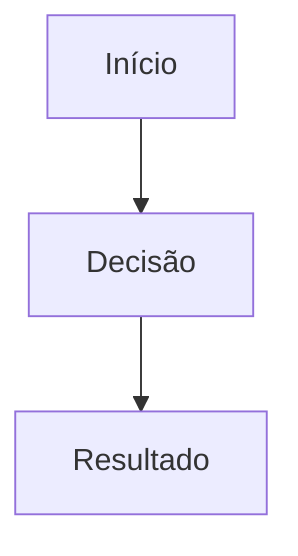

# Guia: escrever e publicar um artigo em Markdown

Este guia é para você escrever direto no navegador, pelo site do GitHub — sem instalar nada.

## 1. Onde o artigo mora

Todo artigo é um arquivo `.md` dentro de `vault/<Grupo>/<Título>.md`. O nome da pasta vira a categoria (aparece em Explorar e no card do artigo); o nome do arquivo vira o título e o endereço (`/blog/...`).

Grupos que já existem: `Pessoa e cognição`, `Sistema e arquitetura de suporte`. Você pode reaproveitar um desses ou criar uma pasta nova — o nome dela vira a categoria automaticamente, sem precisar mexer em código.

## 2. Estrutura mínima do arquivo

```md
---
title: "Nome do artigo"
description: "Uma frase-resumo, a que aparece no card e no motor de busca."
autor: "Seu Nome"
papel: "Seu cargo ou papel"
pilar: "P1"
consciencia: "C1"
data: 2026-10-01
---

> [!summary] Frase-síntese
> Repita aqui a mesma frase da description, ou uma variação dela.

## 1. Origem

Texto do artigo...
```

### Campos do frontmatter (o bloco entre `---`)

| Campo | Obrigatório | O que é |
|---|---|---|
| `title` | sim | Título do artigo |
| `description` | sim | Resumo de uma linha (aparece no card e no `<head>` da página) |
| `autor` | não | Nome exibido na barra de autoria. Sem ele, aparece "Equipe EXECUTAR" |
| `papel` | não | Cargo/papel, abaixo do nome |
| `pilar` | não | `P1` (Problemas e fenômenos), `P2` (Métodos e gestão) ou `P3` (Aplicação e sistemas) — usado pelo filtro em Explorar |
| `consciencia` | não | `C1` (Descoberta), `C2` (Compreensão) ou `C3` (Decisão) — mesma lógica |
| `data` | não | Data no formato `AAAA-MM-DD` |

Se `pilar`/`consciencia` ficarem em branco, o artigo aparece normalmente, só não entra nos filtros de Explorar por esses dois eixos.

## 3. Componentes que você pode usar no corpo do texto

### Callouts (caixas de destaque)

Sintaxe: `> [!tipo] Título opcional` na primeira linha, seguido de `>` nas linhas seguintes.

```md
> [!tip] Dica prática
> Um conselho acionável para quem está lendo.
```

Tipos aceitos e como cada um aparece no site (fundo verde do Desyng System, com um ícone):

| Escreva | Vira |
|---|---|
| `note`, `info`, `todo` | Nota (verde) |
| `tip`, `hint`, `abstract`, `summary`, `tldr`, `important`, `example` | Dica (verde) |
| `success`, `check`, `done`, `quote`, `cite` | Nota (verde) |
| `warning`, `caution`, `attention`, `question`, `help`, `faq` | Atenção (laranja) |
| `danger`, `error`, `failure`, `fail`, `missing`, `bug` | Perigo (vermelho) |

Exemplo com todos os tipos mais usados:

```md
> [!summary] Frase-síntese
> Use logo no início do artigo — é o resumo que aparece em destaque.

> [!tip] Dica prática
> Uma ação concreta que o leitor pode aplicar agora.

> [!warning] Atenção
> Um alerta sobre algo que pode dar errado.

> [!danger] Cuidado
> Um risco sério, que precisa de atenção redobrada.
```

### Títulos e listas (Markdown comum)

```md
## Título de seção
### Subtítulo

- item
- item

1. passo
2. passo

**negrito**, *itálico*, `código em linha`
```

### Tabelas

```md
| Coluna A | Coluna B |
|---|---|
| valor 1 | valor 2 |
```

### Bloco de código

````md
```yaml
chave: valor
```
````

Qualquer linguagem funciona (`js`, `ts`, `bash`, `json`...); o bloco sai com números de linha e botão de copiar.

### Gráficos (bloco `chart`)

````md
```chart
type: bar
title: "Título do gráfico"
summary: "Uma frase explicando o que o gráfico mostra. Obrigatório."
x: ["Categoria A", "Categoria B", "Categoria C"]
y: [10, 25, 8]
height: 320
```
````

- `type`: `bar` (barras), `line` (linha), `scatter` (dispersão) ou `pie` (pizza).
- `title` e `summary` são **obrigatórios** — sem eles o site não publica (regra de acessibilidade: todo gráfico precisa de título e resumo em texto).
- Em `pie`, `x` vira os nomes das fatias e `y` os valores.
- Em `scatter`, `x` e `y` são pares de números (mesma posição em cada lista = um ponto).

### Diagramas (fluxogramas)

````md

````

Funciona só quando alguém roda `npm run content:sync` numa máquina com o Chromium instalado (não nesta sessão de nuvem) — veja a seção 5.

### Links internos para outro artigo

```md
[[Nome exato do outro artigo]]
```

### Imagens

```md

```
A imagem precisa estar na mesma pasta do artigo dentro do `vault/`.

## 4. Publicar manualmente pelo GitHub (sem terminal)

1. Acesse `https://github.com/Sas-Executar/executar-Blog`.
2. Vá até a pasta `vault/`. Entre no grupo (categoria) desejado, ou clique em **Add file → Create new file** para criar um grupo novo (digite `Novo Grupo/Meu Artigo.md` no campo de nome — a barra `/` já cria a pasta).
3. Cole o conteúdo do artigo (frontmatter + corpo) na caixa de texto.
4. Role até o final da página. Em **Commit changes**:
   - Escolha **Create a new branch and start a pull request**.
   - Dê um nome à branch, ex.: `artigo/nome-do-tema`.
5. Clique em **Propose changes**, depois em **Create pull request**.
6. Aguarde a prévia (comentário do robô da Cloudflare no próprio PR, com um link `https://<algo>-executar-blog.sas-executar.workers.dev`) e confira o artigo lá.
7. Se estiver bom, clique em **Merge pull request** — o site de produção publica automaticamente em poucos minutos.

Isso funciona porque a página é gerada a partir do `vault/` continuamente pelo Astro no momento do build — mas **o build da Cloudflare, hoje, publica o conteúdo já processado que está em `apps/blog/src/content/docs/blog/`, não o `vault/` bruto** (veja a limitação abaixo). Por isso, para um artigo novo aparecer no site sem passar por uma sessão do Claude Code, o caminho mais confiável agora é criar o arquivo diretamente também em `apps/blog/src/content/docs/blog/<Grupo>/<Título>.md`, com o mesmo conteúdo (mesmo frontmatter, mas sem os campos extras do Obsidian — veja o exemplo abaixo).

### Exemplo pronto para colar em `apps/blog/src/content/docs/blog/<Grupo>/<Título>.md`

```md
---
title: Nome do artigo
editUrl: false
description: Uma frase-resumo do artigo.
autor: "Seu Nome"
papel: "Seu cargo"
pilar: "P1"
consciencia: "C1"
data: 2026-10-01
---

:::tip[Frase-síntese]
Repita aqui a mesma frase da description.
:::

## 1. Origem

Texto do artigo...

## 2. Contexto

...
```

Repare duas diferenças em relação ao arquivo do `vault/`:
- o callout usa `:::tipo[Título]` ... `:::` em vez de `> [!tipo] Título`;
- tem a linha extra `editUrl: false`.

## 5. Limitação atual (para você saber, não para resolver sozinho)

O comando que converte automaticamente `vault/*.md` → `apps/blog/src/content/docs/blog/*.md` (`npm run content:sync`) precisa de um navegador Chromium instalado para desenhar os diagramas Mermaid. Ele não roda nesta sessão de nuvem do Claude Code. Duas opções:

1. **Publicar você mesmo, sem Claude:** edite os dois arquivos (o do `vault/` e o já convertido em `content/docs/blog/`) manualmente, como no exemplo acima. Funciona para qualquer artigo sem diagrama Mermaid (gráficos `chart` funcionam normalmente, porque não passam pelo Chromium).
2. **Pedir para eu publicar:** me diga o texto do artigo (ou só me avise que criou o PR) que eu rodo o `content:sync` numa máquina com Chromium, ou replico a conversão manualmente, e confirmo que ficou certo antes de ir para produção.
