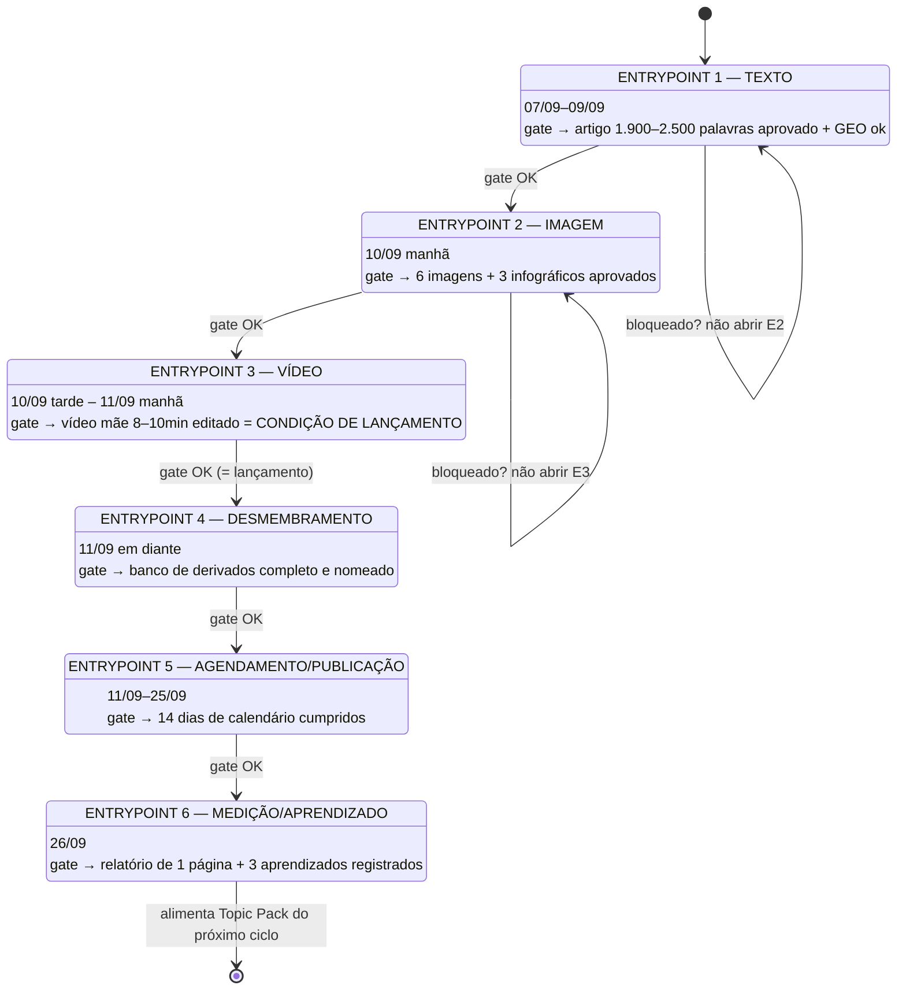
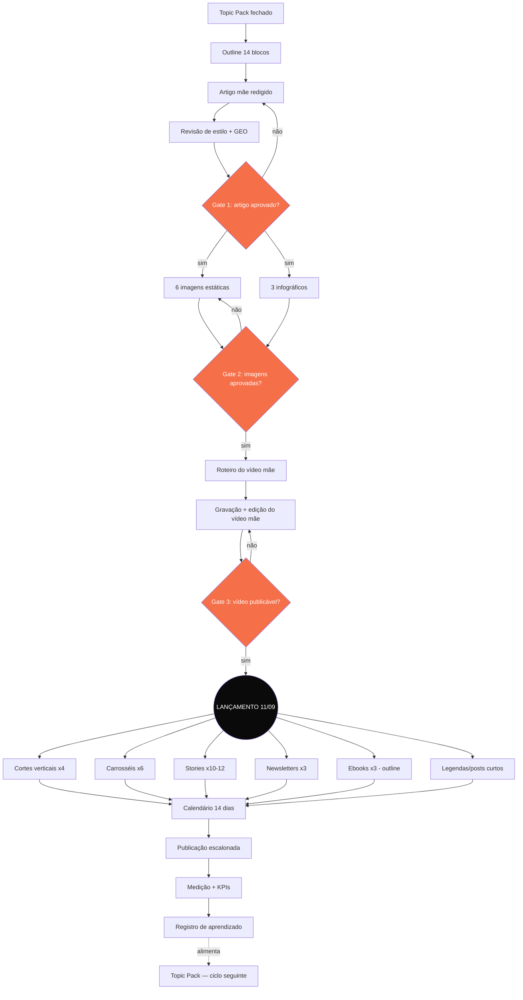
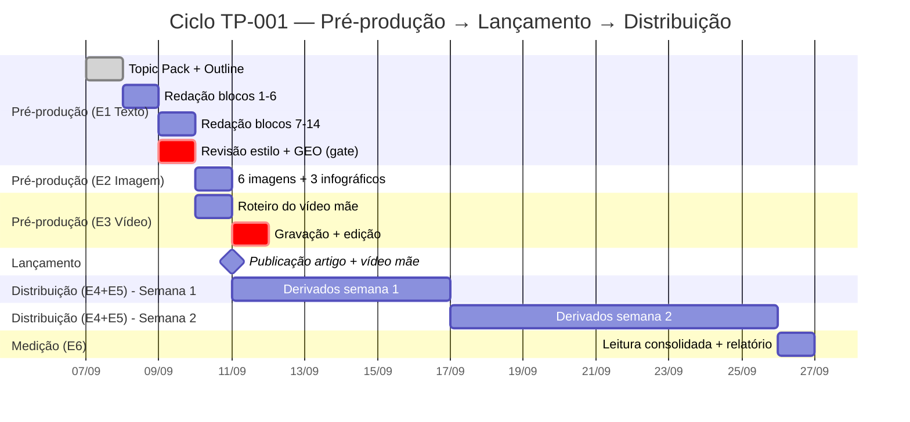
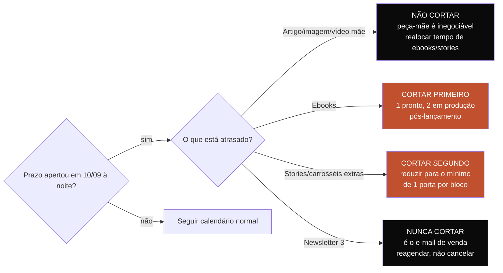

# PAINEL DE SISTEMA — UX OPERACIONAL DA CADEIA DE VALOR
**Código:** RC-CAMP-20260906-F01-UXP-V01
**Companion de:** `RC-CAMP-20260906-F01-RUN-V01__runbook-campanha-lancamento-tp001.md`
**Propósito:** dar visibilidade de sistema sobre o processo — "onde estou, o que está travado, o que abre a seguir" — sem exigir que você segure a cadeia inteira na cabeça. Cada diagrama é uma **vista diferente do mesmo processo**, para responder uma pergunta específica de UX.

---

## 0. POR QUE 4 VISTAS E NÃO 1 SÓ

Um único diagrama gigante tenta responder "onde estou" + "o que trava o quê" + "quando é cada coisa" + "o que falta entregar" ao mesmo tempo — isso é exatamente a sobrecarga informacional que o TP-001 descreve (Fator FRC-03/FRC-04: quantidade e forma da informação competindo pela capacidade de processamento). Por isso, 4 vistas separadas, cada uma com 1 pergunta:

| Vista | Pergunta que responde | Quando consultar |
|---|---|---|
| 1. Máquina de estados | Em qual Entrypoint eu estou agora, e o que preciso fechar para avançar? | Todo dia, no início do trabalho |
| 2. Fluxo de dependência | Se eu mudar/atrasar X, o que quebra depois? | Quando algo atrasa ou muda no meio do ciclo |
| 3. Linha do tempo (Gantt) | O que acontece em cada data do calendário? | Ao planejar a semana |
| 4. Mapa de decisão (corte de escopo) | Se o prazo apertar, o que eu corto primeiro? | Só em emergência de prazo |

---

## 1. VISTA 1 — MÁQUINA DE ESTADOS (onde estou agora)

Este é o diagrama de referência diária. Cada retângulo é um estado com gate de saída explícito — você nunca "acha" que terminou, o diagrama define o critério.

**Regra de leitura:** se você está "meio no Entrypoint 2, meio no 3" ao mesmo tempo, o sistema está fora do desenho — pare e feche o gate do estado atual antes de tocar no próximo.

---

## 2. VISTA 2 — FLUXO DE DEPENDÊNCIA (o que quebra o quê)

Usa esta vista quando algo atrasa. Ela mostra, por artefato, **tudo que depende dele rio abaixo** — assim você decide o que precisa avisar/replanejar em vez de descobrir o efeito colateral depois.

**Leitura prática:** repare que **tudo** que está depois de `L (LANÇAMENTO)` depende do vídeo mãe estar pronto — nenhum corte vertical, carrossel ou story existe sem a peça-mãe fechada. Se o vídeo atrasa, o efeito é em cascata sobre 6 ramos simultâneos, não sobre 1.

---

## 3. VISTA 3 — LINHA DO TEMPO (Gantt do ciclo completo)

Usa esta vista para planejar a semana — ela não mostra dependência lógica, mostra **quando** cada bloco de trabalho acontece.

---

## 4. VISTA 4 — MAPA DE DECISÃO (corte de escopo sob pressão de prazo)

Usa esta vista **só** se 10/09 à noite chegar com item pendente. Ela existe para você não decidir sob estresse — a decisão já está tomada com antecedência.

---

## 5. TABELA CONSOLIDADA DE KPIs

| KPI | Tipo | Meta do ciclo | Canal de medição | Fase de leitura |
|---|---|---|---|---|
| Leituras do artigo mãe | Primário | Baseline (1º ciclo) | Analytics do blog | E6 — 26/09 |
| Visualizações do vídeo mãe (>50% assistido) | Primário | Baseline (1º ciclo) | YouTube Studio | E6 — 26/09 |
| Cliques no CTA do Scanner (todos canais) | Primário | Baseline (1º ciclo) | UTM por canal | E6 — 26/09 |
| Scanners iniciados | Primário | Baseline (1º ciclo) | Produto/app | E6 — 26/09 |
| Scanners completados | Primário | Baseline (1º ciclo) | Produto/app | E6 — 26/09 |
| Inscritos na newsletter (via ciclo) | Primário | Baseline (1º ciclo) | Ferramenta de e-mail | E6 — 26/09 |
| Alcance + salvamentos dos carrosséis | Secundário | Acompanhar | Instagram Insights | Contínuo |
| Tempo de leitura + comentários (LinkedIn) | Secundário | Acompanhar | LinkedIn Analytics | Contínuo |
| Retenção nos 3s iniciais (Reels/TikTok) | Secundário | Acompanhar | Meta/TikTok Ads Manager | Contínuo |
| Taxa de abertura por e-mail (1, 2, 3) | Secundário | Acompanhar progressão | Ferramenta de e-mail | Após cada envio |

---

## 6. TABELA CONSOLIDADA DE ASSETS (o que precisa existir)

| # | Asset | Quantidade | Entrypoint de origem | Formato/duração |
|---|---|---|---|---|
| 1 | Artigo mãe | 1 | E1 | 1.900–2.500 palavras |
| 2 | Imagens estáticas | 6 | E2 | 1:1 feed |
| 3 | Infográficos "cena ambiente" | 3 | E2 | 16:9 |
| 4 | Vídeo mãe | 1 | E3 | 8–10 min |
| 5 | Vídeos verticais (cortes) | 4 | E4 | 15–60s |
| 6 | Carrosséis | 6 | E4 | 1 ideia/slide |
| 7 | Legendas Instagram | 3 | E4 | curto |
| 8 | Posts texto LinkedIn | 2 | E4 | médio |
| 9 | Ganchos TikTok/Reels | 3 | E4 | 1ª linha de legenda |
| 10 | Sequência de stories | 10–12 | E4 | 4 portas (descoberta/prova/urgência/retenção) |
| 11 | Newsletters | 3 | E4 | e-mail |
| 12 | Ebooks (outline) | 3 | E4 | lead magnet |
| 13 | CTAs de ferramenta (Scanner) mapeados | 6 | E4 | distribuídos entre peças |
| 14 | Calendário de publicação | 1 | E5 | 14 dias, data/canal/peça |
| 15 | Relatório de KPIs + aprendizados | 1 | E6 | 1 página |

**Total de peças de conteúdo publicáveis no ciclo: 39** (1 artigo + 9 imagens/infográficos + 1 vídeo mãe + 4 verticais + 6 carrosséis + 8 textos curtos + 10–12 stories + 3 newsletters + 3 ebooks).

---

## 7. CHECKLIST DE ENTREGA (gate final antes de considerar o ciclo fechado)

### 7.1 Gate de lançamento (11/09 — bloqueante)
- [ ] Artigo mãe aprovado (1.900–2.500 palavras, GEO aplicado)
- [ ] 6 imagens + 3 infográficos aprovados
- [ ] Vídeo mãe editado (8–10 min)
- [ ] Artigo publicado no blog
- [ ] Vídeo mãe publicado no YouTube
- [ ] Newsletter 1 enviada
- [ ] Stories 1–4 publicados (porta: descoberta)
- [ ] Post LinkedIn 1 publicado

### 7.2 Gate de distribuição — semana 1 (11/09–16/09)
- [ ] Vídeo vertical 1 (Fator 1) publicado — Reels + TikTok
- [ ] Carrossel 1 publicado
- [ ] Stories 5–8 publicados (porta: prova)
- [ ] Corte YouTube Shorts 1 publicado
- [ ] Post LinkedIn 2 publicado
- [ ] Newsletter 2 enviada
- [ ] Vídeo vertical 2 (Fator 3) publicado
- [ ] Carrossel 2 + imagem estática 1 publicados

### 7.3 Gate de distribuição — semana 2 (17/09–25/09)
- [ ] Vídeo vertical 3 (Fator 6) publicado
- [ ] Stories 9–10 publicados (porta: urgência)
- [ ] Vídeo nativo LinkedIn publicado
- [ ] Carrossel 3 + imagem estática 2 publicados
- [ ] Newsletter 3 enviada
- [ ] Vídeo vertical 4 (Fator 8) publicado
- [ ] Stories 11–12 publicados (porta: retenção) + CTA Scanner
- [ ] Carrossel 4 + imagem estática 3 publicados
- [ ] Corte YouTube Shorts 2 publicado
- [ ] Carrossel 5 + imagem estática 4 publicados
- [ ] Post LinkedIn de síntese publicado
- [ ] Carrossel 6 + imagens estáticas 5–6 publicados
- [ ] 3 ebooks publicados como CTA

### 7.4 Gate de fechamento de ciclo (26/09)
- [ ] Todos os 6 KPIs primários lidos
- [ ] KPIs secundários por canal lidos
- [ ] Relatório de 1 página escrito
- [ ] 3 aprendizados registrados
- [ ] Topic Pack do próximo ciclo (Artigo 03 — Exposição Cognitiva) rascunhado a partir do aprendizado

---

## 8. COMO ESTA VISTA SE CONECTA AO RUNBOOK

Este documento não substitui `RC-CAMP-20260906-F01-RUN-V01` — ele é a camada de visualização/estado sobre o mesmo processo. Ordem de uso recomendada:
1. Abra a **Vista 1** todo dia para saber em que Entrypoint você está.
2. Consulte o **runbook** para os passos detalhados daquele Entrypoint.
3. Use a **Vista 2** só se algo atrasar ou mudar no meio do caminho.
4. Use a **Vista 3** para planejar a semana.
5. Use a **Vista 4** só em emergência real de prazo.
6. Marque os checklists da seção 7 conforme publica — eles espelham exatamente as tabelas de calendário do runbook (seções 7.1/7.2 do runbook).
