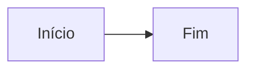

> [!summary] Frase-síntese
> Um arquivo só, legível no Obsidian e publicado no blog.

## Texto

Texto com **negrito**, *itálico*, ~~riscado~~, ==destaque== e `código`. %%comentário invisível%% Uma #tag inline.
Link para [[Fatores de Riscos Cognitivos]], com alias [[Competição pela atenção|atenção]], para um [[Sintaxe completa#Tarefas|título]] e para um [[Sintaxe completa#^bloco-alvo|bloco]]. Link quebrado: [[Nota que não existe]].

Parágrafo com âncora de bloco. ^bloco-alvo

%%
Comentário de bloco
que atravessa linhas.
%%

Nota de rodapé[^1].

[^1]: Texto da nota de rodapé.

## Tarefas

- [ ] a fazer
- [x] feita
- [/] em andamento
- [-] cancelada
- [!] importante
- [?] pergunta

## Callouts

> [!tip] Dica prática
> Conteúdo da dica.

> [!warning]- Fechado por padrão
> Conteúdo escondido.

> [!danger]+ Aberto por padrão
> Conteúdo visível.

## Matemática

Inline $E = mc^2$ e bloco:

$$
\sum_{i=1}^{n} i = \frac{n(n+1)}{2}
$$

## Diagrama



## Gráfico

```chart
type: bar
title: "Barras de teste"
summary: "Três valores fictícios usados no teste."
x: ["A", "B", "C"]
y: [3, 5, 2]
```

## Diretivas

::toc

::::tabs
:::tab[Primeira]
Conteúdo da primeira aba.
:::
:::tab[Segunda]
Conteúdo da segunda aba.
:::
::::

::::columns
:::column
Coluna um.
:::
:::column
Coluna dois.
:::
::::

:::toggle[Clique para abrir]
Conteúdo do toggle.
:::

:::callout{type=insight}
Callout por diretiva.
:::

:::card[Cartão]
Conteúdo do cartão.
:::

:::grid{cols=3}
- um
- dois
- três
:::

:::steps
1. Primeiro passo
2. Segundo passo
:::

:::timeline
- **2024** — Início
- **2026** — Hoje
:::

::metric{value="42%" label="Redução de retrabalho" delta="-12%"}

:::comparison
Antes era assim.

---

Depois ficou assim.
:::

:::quote{autor="Ada Lovelace"}
Uma citação com autoria.
:::

:::figure{caption="Legenda da figura"}
Conteúdo da figura.
:::

::embed{url="https://www.youtube-nocookie.com/embed/dQw4w9WgXcQ" title="Vídeo de exemplo"}

::embed{url="https://exemplo.com/pagina" title="Site externo"}

::database{from="Laboratório" columns="title,pilar,status"}

:::desconhecida
Conteúdo preservado de diretiva desconhecida.
:::
