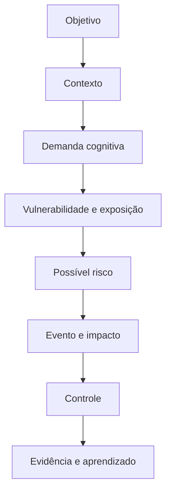
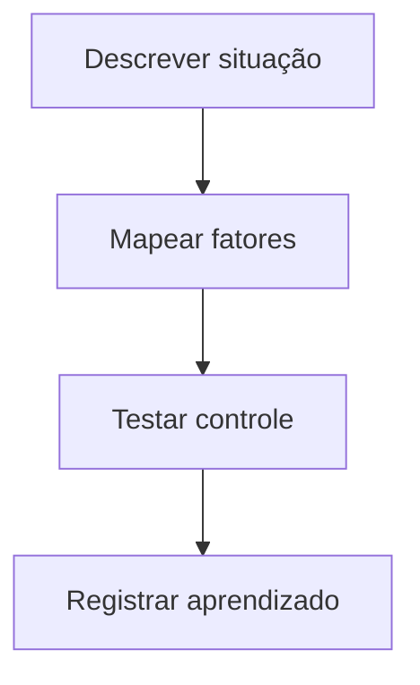

> [!summary] Frase-síntese
> A execução também depende do sistema ao redor. — síntese a partir de ISO e W3C COGA

> [!info] Ficha do fator
> - **Termo:** Fatores de riscos cognitivos
> - **Grupo:** Visão geral (todos os grupos)
> - **Referência:** ISO e W3C COGA
> - **Problema:** A pessoa percebe sobrecarga, esquecimento, interrupções ou retrabalho sem localizar as condições que aumentam a demanda
> - **Controle:** Cada sinal é ligado ao contexto, à demanda, ao controle e à evidência
> - **Sinais:** esforço, atraso, erro, retrabalho

## Origem

**Termo.** Fatores de riscos cognitivos.  
**Significado.** Condições da interação entre pessoa, tarefa, ambiente, processo e tecnologia que podem aumentar demandas relevantes para um objetivo.  
**Etimologia.** Fator vem do latim *factor*, aquilo que faz; risco tem origem discutida; cognitivo deriva de *cognoscere*, conhecer. No EXECUTAR, fator não equivale automaticamente a risco.

## Contexto

Uma pessoa abre um relatório e, antes de escrever, procura arquivos, interpreta prioridades, resolve dependências, responde interrupções e tenta lembrar o próximo passo. O trabalho principal ainda não começou, mas a demanda cognitiva já começou.

## 5W2H

| Variável | Síntese |
|---|---|
| O que? | Mapear condições que aumentam demanda cognitiva na execução. |
| Por quê? | Separar dificuldade individual de barreira criada pelo sistema. |
| Onde? | Trabalho, estudo, rotina, projetos e tecnologia. |
| Quando? | Quando esforço, atraso, erro ou retrabalho se repetirem. |
| Quem? | Executor e responsáveis pelo desenho do trabalho. |
| Como? | Observar fatores, exposição, controles e efeitos. |
| Quanto? | Uma situação real e um controle por ciclo. |

## Referência padrão-ouro

A ISO 10075-2:2024 é a referência institucional central deste recorte porque orienta o desenho de sistemas de trabalho considerando carga mental, tarefa, equipamento, ambiente e fatores organizacionais. O W3C COGA complementa com padrões aplicáveis à acessibilidade cognitiva digital.


## Problema existente

**Definição.** A pessoa percebe sobrecarga, esquecimento, interrupções ou retrabalho sem localizar as condições que aumentam a demanda.  
**Identificação.** Informação, tarefa, dependência, memória e tecnologia exigem reconstrução contínua.  
**Explicação.** O custo fica distribuído e parece uma falha individual.  
**Fechamento.** O sistema consome capacidade antes de produzir valor.

## Problema solucionado

**Definição.** Os fatores tornam-se pontos de inspeção da arquitetura da execução.  
**Identificação.** Cada sinal é ligado ao contexto, à demanda, ao controle e à evidência.  
**Explicação.** A análise separa fator, vulnerabilidade, exposição, risco, evento e impacto.  
**Fechamento.** Torna-se possível testar uma mudança sem diagnosticar a pessoa.

## Processo

:::steps
1. **Entender:** definir objetivo, contexto, sinais e impacto observável.
2. **Estruturar:** classificar fatores e escolher um controle proporcional.
3. **Executar:** testar, medir, aprender e atualizar o sistema.
:::

## Visão do sistema



## Progresso esperado

Antes, a dificuldade parece estar apenas na pessoa. Ao mapear uma situação real, fatores e controles ficam visíveis. Depois, o leitor consegue escolher uma mudança pequena — como esclarecer tarefa, revelar dependência ou preservar contexto — e observar seu efeito.

> [!attention]
> Este framework é operacional e educativo. Não constitui diagnóstico, avaliação clínica ou modelo causal cientificamente validado como unidade única.

## Próximos passos

> [!decision] Next 01-02-03
> 1. **Entender:** descreva uma atividade que exige esforço desproporcional.
> 2. **Estruturar:** marque quais dos vinte fatores aparecem e escolha um controle.
> 3. **Executar:** teste o controle, compare o resultado e registre a evidência.



## Fontes e aprofundamento

- [ISO 10075-2:2024](https://www.iso.org/standard/76686.html) — International Organization for Standardization, 2024.
- [Making Content Usable](https://www.w3.org/TR/coga-usable/) — W3C WAI, 2021.
- [Cognitive Offloading](https://pubmed.ncbi.nlm.nih.gov/27542527/) — Risko e Gilbert, 2016.

## Painel ilustrativo (dados fictícios)

```chart
type: bar
title: "Fatores mapeados por grupo (dados fictícios)"
summary: "Contagem ilustrativa de fatores por grupo temático, apenas para demonstrar o painel. Dados fictícios."
x: ["Pessoa e cognição", "Tarefa e fluxo", "Informação e interface", "Ambiente e contexto", "Sistema e suporte"]
y: [4, 5, 4, 3, 4]
height: 320
```
