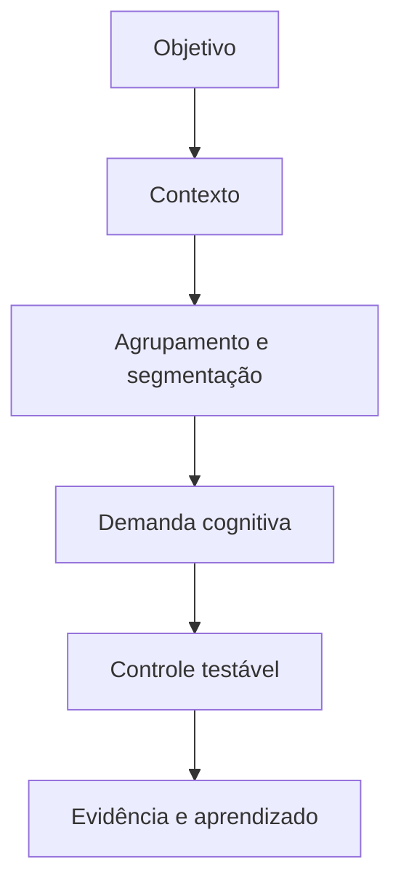
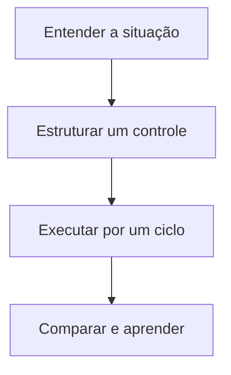

> [!summary] Frase-síntese
> Agrupar bem transforma muitos itens em unidades navegáveis. — síntese a partir de Luck e Vogel

```yaml title="fator.yaml"
fator:
  termo: Agrupamento e segmentação
  grupo: Informação e interface
  referencia: Luck e Vogel
  problema: Itens sem agrupamento competem como unidades equivalentes
  controle: Agrupar por função, etapa ou decisão e nomear cada conjunto
  sinais: [esforço, erro, espera, retrabalho]
```

## 1. Origem

**Termo.** Agrupamento e segmentação.  
**Significado.** Condição da execução que merece observação e controle.  
**Etimologia.** Chunking deriva de chunk, bloco ou pedaço. Em português, agrupamento segmenta elementos relacionados em unidades reconhecíveis, sem afirmar um número universal de itens.

## 2. Contexto

Uma lista longa mistura ações, referências e decisões. O leitor precisa classificar tudo mentalmente antes de usar. O fator não caracteriza risco sozinho: precisa ser analisado com objetivo, contexto, vulnerabilidade, exposição e impacto.

## 3. 5W2H

| Variável | Síntese |
|---|---|
| O que? | Investigar agrupamento e segmentação na execução real. |
| Por quê? | Reduzir demanda evitável e proteger o objetivo. |
| Onde? | Pessoa, tarefa, ambiente, processo ou tecnologia. |
| Quando? | Quando esforço, erro, espera ou retrabalho aumentarem. |
| Quem? | Executor, responsável pelo processo e projetista do sistema. |
| Como? | Observar sinais, testar controle e comparar resultado. |
| Quanto? | Um experimento pequeno por ciclo de execução. |

## 4. Referência padrão-ouro

Luck e Vogel é usado como referência central deste framework porque a fonte associada documenta princípios ou achados diretamente aplicáveis ao fator. A centralidade vale para este recorte; não significa consenso exclusivo sobre todo o tema.


## 5. Problema existente

**Definição.** Itens sem agrupamento competem como unidades equivalentes.  
**Identificação.** Aparece como esforço extra, atraso, erro, esquecimento, espera ou reconstrução.  
**Explicação.** A execução absorve uma demanda que poderia estar no desenho do sistema.  
**Fechamento.** A capacidade disponível deixa de servir integralmente ao objetivo.

## 6. Problema solucionado

**Definição.** A parte controlável do fator fica visível e recebe um experimento.  
**Identificação.** Agrupar por função, etapa ou decisão e nomear cada conjunto.  
**Explicação.** O controle transfere demanda evitável para ambiente, processo ou tecnologia.  
**Fechamento.** O resultado passa a ser observado sem prometer eliminação do problema.

## 7. Processo

1. **Entender:** registrar situação, objetivo, sinais e impacto observável.
2. **Estruturar:** localizar o fator e escolher um controle pequeno e reversível.
3. **Executar:** aplicar o controle, comparar antes e depois e registrar aprendizado.

## 8. Visão do sistema



## 9. Progresso esperado

Antes, a pessoa sustenta parte do sistema mentalmente. Com um controle pequeno, observa menos reconstrução ou esforço evitável. Depois, a próxima ação, o estado e o critério ficam mais visíveis no cotidiano, sem afirmar resultado universal.

## 10. Aviso

Conteúdo educativo e operacional. Não diagnostica condição clínica nem transforma característica individual em risco. O efeito depende da pessoa, tarefa, ambiente e contexto.

## 11. Next 01-02-03

**Next 01 — Entender:** escolha uma situação real e descreva onde o esforço aparece.  
**Next 02 — Estruturar:** selecione um controle diretamente ligado ao fator observado.  
**Next 03 — Executar:** teste por um ciclo, compare sinais e registre o que mudou.



## 12. Fontes e aprofundamento

- [The capacity of visual working memory for features and conjunctions](https://doi.org/10.1038/36846) — Luck e Vogel, 1997.


## 13. Painel ilustrativo (dados fictícios)

```chart
type: bar
title: "Tempo de busca por organização da lista (dados fictícios)"
summary: "Segundos ilustrativos até encontrar um item, conforme a lista ganha agrupamento. Dados fictícios."
x: ["Sem grupo", "Grupo simples", "Grupo + rótulo", "Grupo + busca"]
y: [42, 30, 18, 10]
height: 320
```

## Relacionados

- [[Clareza e escrita da tarefa]]
- [[Dependências e cadeia de valor]]
