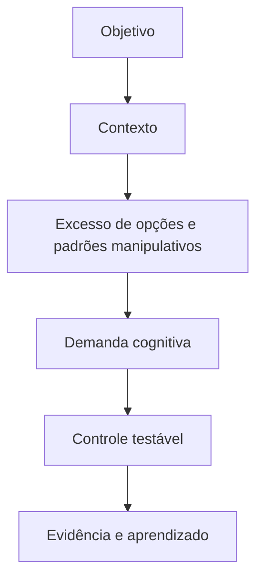
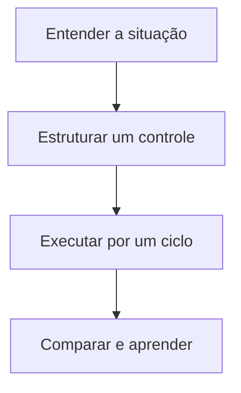

> [!summary] Frase-síntese
> Escolha útil exige opções compreensíveis e honestas. — síntese a partir de W3C WAI

```yaml title="fator.yaml"
fator:
  termo: Excesso de opções e padrões manipulativos
  grupo: Informação e interface
  referencia: W3C WAI
  problema: Quantidade, assimetria e manipulação tornam a escolha mais trabalhosa
  controle: Reduzir opções irrelevantes e apresentar consequências com simetria
  sinais: [esforço, erro, espera, retrabalho]
```

## 1. Origem

**Termo.** Excesso de opções e padrões manipulativos.  
**Significado.** Condição da execução que merece observação e controle.  
**Etimologia.** Opção vem do latim optio, escolha. Dark pattern é um padrão de interface que direciona decisões contra o interesse do usuário; aqui usamos “padrão manipulativo”.

## 2. Contexto

Uma tela oferece muitas alternativas, pré-seleciona a mais vantajosa ao serviço e dificulta comparar consequências. O fator não caracteriza risco sozinho: precisa ser analisado com objetivo, contexto, vulnerabilidade, exposição e impacto.

## 3. 5W2H

| Variável | Síntese |
|---|---|
| O que? | Investigar excesso de opções e padrões manipulativos na execução real. |
| Por quê? | Reduzir demanda evitável e proteger o objetivo. |
| Onde? | Pessoa, tarefa, ambiente, processo ou tecnologia. |
| Quando? | Quando esforço, erro, espera ou retrabalho aumentarem. |
| Quem? | Executor, responsável pelo processo e projetista do sistema. |
| Como? | Observar sinais, testar controle e comparar resultado. |
| Quanto? | Um experimento pequeno por ciclo de execução. |

## 4. Referência padrão-ouro

W3C WAI é usado como referência central deste framework porque a fonte associada documenta princípios ou achados diretamente aplicáveis ao fator. A centralidade vale para este recorte; não significa consenso exclusivo sobre todo o tema.


## 5. Problema existente

**Definição.** Quantidade, assimetria e manipulação tornam a escolha mais trabalhosa.  
**Identificação.** Aparece como esforço extra, atraso, erro, esquecimento, espera ou reconstrução.  
**Explicação.** A execução absorve uma demanda que poderia estar no desenho do sistema.  
**Fechamento.** A capacidade disponível deixa de servir integralmente ao objetivo.

## 6. Problema solucionado

**Definição.** A parte controlável do fator fica visível e recebe um experimento.  
**Identificação.** Reduzir opções irrelevantes e apresentar consequências com simetria.  
**Explicação.** O controle transfere demanda evitável para ambiente, processo ou tecnologia.  
**Fechamento.** O resultado passa a ser observado sem prometer eliminação do problema.

## 7. Processo

1. **Entender:** registrar situação, objetivo, sinais e impacto observável.
2. **Estruturar:** localizar o fator e escolher um controle pequeno e reversível.
3. **Executar:** aplicar o controle, comparar antes e depois e registrar aprendizado.

## 8. Visão do sistema



## 9. Progresso esperado

Antes, a pessoa sustenta parte do sistema mentalmente. Com um controle pequeno, observa menos reconstrução ou esforço evitável. Depois, a próxima ação, o estado e o critério ficam mais visíveis no cotidiano, sem afirmar resultado universal.

## 10. Aviso

Conteúdo educativo e operacional. Não diagnostica condição clínica nem transforma característica individual em risco. O efeito depende da pessoa, tarefa, ambiente e contexto.

## 11. Next 01-02-03

**Next 01 — Entender:** escolha uma situação real e descreva onde o esforço aparece.  
**Next 02 — Estruturar:** selecione um controle diretamente ligado ao fator observado.  
**Next 03 — Executar:** teste por um ciclo, compare sinais e registre o que mudou.



## 12. Fontes e aprofundamento

- [Avoid Too Much Content](https://www.w3.org/WAI/WCAG2/supplemental/patterns/o5p03-manageable-quantity/) — W3C WAI, 2021.


## 13. Painel ilustrativo (dados fictícios)

```chart
type: bar
title: "Desistência por número de opções (dados fictícios)"
summary: "Taxa ilustrativa (%) de desistência da tarefa conforme o número de opções apresentadas. Dados fictícios."
x: ["3 opções", "6 opções", "12 opções", "20+ opções"]
y: [8, 15, 34, 52]
height: 320
```

## Relacionados

- [[Memória prospectiva]]
- [[Fadiga decisória]]
