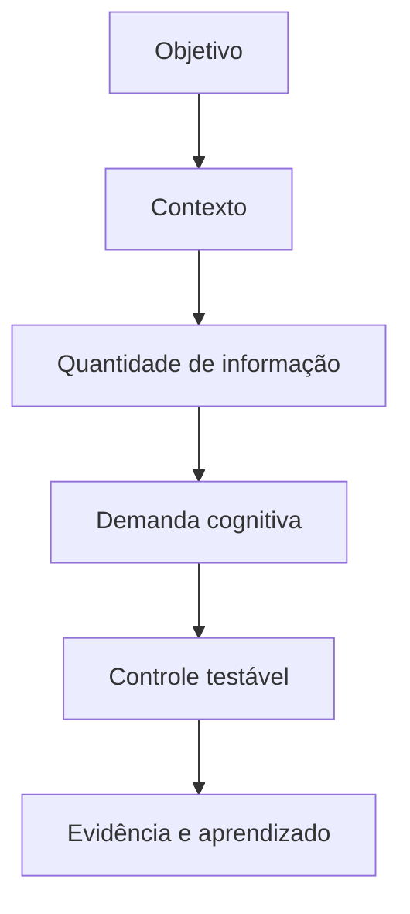
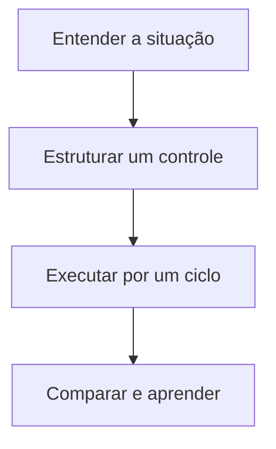

> [!summary] Frase-síntese
> Mais informação disponível não significa mais informação utilizável. — síntese a partir de W3C WAI

```yaml title="fator.yaml"
fator:
  termo: Quantidade de informação
  grupo: Informação e interface
  referencia: W3C WAI
  problema: Volume simultâneo aumenta busca, comparação e manutenção mental
  controle: Exibir primeiro o essencial e revelar detalhes sob demanda
  sinais: [esforço, erro, espera, retrabalho]
```

## 1. Origem

**Termo.** Quantidade de informação.  
**Significado.** Condição da execução que merece observação e controle.  
**Etimologia.** Quantidade vem do latim quantitas, medida de quanto existe. Informação deriva de informare, dar forma. A torção prática é clara: acumular dados não garante que eles assumam forma útil.

## 2. Contexto

Uma tela mostra mensagens, arquivos, métricas e histórico ao mesmo tempo. Antes de agir, a pessoa precisa separar o necessário do restante. O fator não caracteriza risco sozinho: precisa ser analisado com objetivo, contexto, vulnerabilidade, exposição e impacto.

## 3. 5W2H

| Variável | Síntese |
|---|---|
| O que? | Investigar quantidade de informação na execução real. |
| Por quê? | Reduzir demanda evitável e proteger o objetivo. |
| Onde? | Pessoa, tarefa, ambiente, processo ou tecnologia. |
| Quando? | Quando esforço, erro, espera ou retrabalho aumentarem. |
| Quem? | Executor, responsável pelo processo e projetista do sistema. |
| Como? | Observar sinais, testar controle e comparar resultado. |
| Quanto? | Um experimento pequeno por ciclo de execução. |

## 4. Referência padrão-ouro

W3C WAI é usado como referência central deste framework porque a fonte associada documenta princípios ou achados diretamente aplicáveis ao fator. A centralidade vale para este recorte; não significa consenso exclusivo sobre todo o tema.


## 5. Problema existente

**Definição.** Volume simultâneo aumenta busca, comparação e manutenção mental.  
**Identificação.** Aparece como esforço extra, atraso, erro, esquecimento, espera ou reconstrução.  
**Explicação.** A execução absorve uma demanda que poderia estar no desenho do sistema.  
**Fechamento.** A capacidade disponível deixa de servir integralmente ao objetivo.

## 6. Problema solucionado

**Definição.** A parte controlável do fator fica visível e recebe um experimento.  
**Identificação.** Exibir primeiro o essencial e revelar detalhes sob demanda.  
**Explicação.** O controle transfere demanda evitável para ambiente, processo ou tecnologia.  
**Fechamento.** O resultado passa a ser observado sem prometer eliminação do problema.

## 7. Processo

1. **Entender:** registrar situação, objetivo, sinais e impacto observável.
2. **Estruturar:** localizar o fator e escolher um controle pequeno e reversível.
3. **Executar:** aplicar o controle, comparar antes e depois e registrar aprendizado.

## 8. Visão do sistema



## 9. Progresso esperado

Antes, a pessoa sustenta parte do sistema mentalmente. Com um controle pequeno, observa menos reconstrução ou esforço evitável. Depois, a próxima ação, o estado e o critério ficam mais visíveis no cotidiano, sem afirmar resultado universal.

## 10. Aviso

Conteúdo educativo e operacional. Não diagnostica condição clínica nem transforma característica individual em risco. O efeito depende da pessoa, tarefa, ambiente e contexto.

## 11. Next 01-02-03

**Next 01 — Entender:** escolha uma situação real e descreva onde o esforço aparece.  
**Next 02 — Estruturar:** selecione um controle diretamente ligado ao fator observado.  
**Next 03 — Executar:** teste por um ciclo, compare sinais e registre o que mudou.



## 12. Fontes e aprofundamento

- [Avoid Too Much Content](https://www.w3.org/WAI/WCAG2/supplemental/patterns/o5p03-manageable-quantity/) — W3C WAI, 2021.


## 13. Painel ilustrativo (dados fictícios)

<figure class="grafico">
	<figcaption>Retenção por volume de itens (dados fictícios)</figcaption>
	<div class="area" style="height:320px" data-grafico='{"tooltip":{},"grid":{"left":8,"right":16,"top":24,"bottom":8,"containLabel":true},"xAxis":{"type":"category","data":["3 itens","5 itens","7 itens","9+ itens"],"axisLabel":{"interval":0,"rotate":0}},"yAxis":{"type":"value"},"series":[{"type":"bar","data":[92,81,63,44],"itemStyle":{"borderRadius":4}}]}' data-descricao="Retenção por volume de itens (dados fictícios). Percentual ilustrativo de itens lembrados corretamente conforme a lista cresce. Dados fictícios." role="img" aria-label="Retenção por volume de itens (dados fictícios). Percentual ilustrativo de itens lembrados corretamente conforme a lista cresce. Dados fictícios."></div>
	<p class="resumo">Percentual ilustrativo de itens lembrados corretamente conforme a lista cresce. Dados fictícios.</p>
</figure>

## Relacionados

- [[Perfil cognitivo do executor]]
- [[Forma e visualização da informação]]
