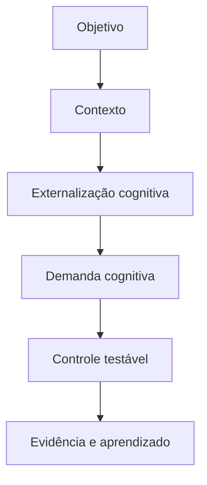
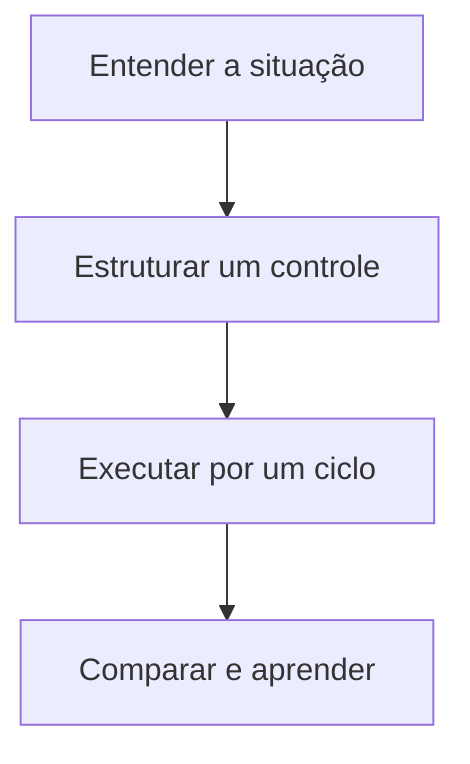

> [!summary] Frase-síntese
> O ambiente pode carregar parte do trabalho mental. — síntese a partir de Risko e Gilbert

```yaml title="fator.yaml"
fator:
  termo: Externalização cognitiva
  grupo: Sistema e arquitetura de suporte
  referencia: Risko e Gilbert
  problema: Estado, intenção e contexto ficam presos à memória individual
  controle: Registrar decisões, próximos passos, gatilhos e pontos de retomada
  sinais: [esforço, erro, espera, retrabalho]
```

## 1. Origem

**Termo.** Externalização cognitiva.  
**Significado.** Condição da execução que merece observação e controle.  
**Etimologia.** Externalizar vem de externo: deslocar algo para fora. Cognição vem de cognoscere, conhecer. É usar ações ou representações externas para mudar a demanda interna da tarefa.

## 2. Contexto

Uma decisão permanece apenas na memória de quem a tomou. Depois de uma interrupção, o grupo precisa reconstruí-la. O fator não caracteriza risco sozinho: precisa ser analisado com objetivo, contexto, vulnerabilidade, exposição e impacto.

## 3. 5W2H

| Variável | Síntese |
|---|---|
| O que? | Investigar externalização cognitiva na execução real. |
| Por quê? | Reduzir demanda evitável e proteger o objetivo. |
| Onde? | Pessoa, tarefa, ambiente, processo ou tecnologia. |
| Quando? | Quando esforço, erro, espera ou retrabalho aumentarem. |
| Quem? | Executor, responsável pelo processo e projetista do sistema. |
| Como? | Observar sinais, testar controle e comparar resultado. |
| Quanto? | Um experimento pequeno por ciclo de execução. |

## 4. Referência padrão-ouro

Risko e Gilbert é usado como referência central deste framework porque a fonte associada documenta princípios ou achados diretamente aplicáveis ao fator. A centralidade vale para este recorte; não significa consenso exclusivo sobre todo o tema.


## 5. Problema existente

**Definição.** Estado, intenção e contexto ficam presos à memória individual.  
**Identificação.** Aparece como esforço extra, atraso, erro, esquecimento, espera ou reconstrução.  
**Explicação.** A execução absorve uma demanda que poderia estar no desenho do sistema.  
**Fechamento.** A capacidade disponível deixa de servir integralmente ao objetivo.

## 6. Problema solucionado

**Definição.** A parte controlável do fator fica visível e recebe um experimento.  
**Identificação.** Registrar decisões, próximos passos, gatilhos e pontos de retomada.  
**Explicação.** O controle transfere demanda evitável para ambiente, processo ou tecnologia.  
**Fechamento.** O resultado passa a ser observado sem prometer eliminação do problema.

## 7. Processo

1. **Entender:** registrar situação, objetivo, sinais e impacto observável.
2. **Estruturar:** localizar o fator e escolher um controle pequeno e reversível.
3. **Executar:** aplicar o controle, comparar antes e depois e registrar aprendizado.

## 8. Visão do sistema



## 9. Progresso esperado

Antes, a pessoa sustenta parte do sistema mentalmente. Com um controle pequeno, observa menos reconstrução ou esforço evitável. Depois, a próxima ação, o estado e o critério ficam mais visíveis no cotidiano, sem afirmar resultado universal.

## 10. Aviso

Conteúdo educativo e operacional. Não diagnostica condição clínica nem transforma característica individual em risco. O efeito depende da pessoa, tarefa, ambiente e contexto.

## 11. Next 01-02-03

**Next 01 — Entender:** escolha uma situação real e descreva onde o esforço aparece.  
**Next 02 — Estruturar:** selecione um controle diretamente ligado ao fator observado.  
**Next 03 — Executar:** teste por um ciclo, compare sinais e registre o que mudou.



## 12. Fontes e aprofundamento

- [Cognitive Offloading](https://pubmed.ncbi.nlm.nih.gov/27542527/) — Risko e Gilbert, 2016.


## 13. Painel ilustrativo (dados fictícios)

<figure class="grafico">
	<figcaption>Confiabilidade por forma de registro (dados fictícios)</figcaption>
	<div class="area" style="height:320px" data-grafico='{"tooltip":{},"grid":{"left":8,"right":16,"top":24,"bottom":8,"containLabel":true},"xAxis":{"type":"category","data":["Memória","Nota simples","Checklist","Sistema"],"axisLabel":{"interval":0,"rotate":0}},"yAxis":{"type":"value"},"series":[{"type":"bar","data":[40,62,81,93],"itemStyle":{"borderRadius":4}}]}' data-descricao="Confiabilidade por forma de registro (dados fictícios). Percentual ilustrativo de recuperação correta da informação, por forma de registro. Dados fictícios." role="img" aria-label="Confiabilidade por forma de registro (dados fictícios). Percentual ilustrativo de recuperação correta da informação, por forma de registro. Dados fictícios."></div>
	<p class="resumo">Percentual ilustrativo de recuperação correta da informação, por forma de registro. Dados fictícios.</p>
</figure>

## Relacionados

- [[Dependências e cadeia de valor]]
- [[Memória prospectiva]]
