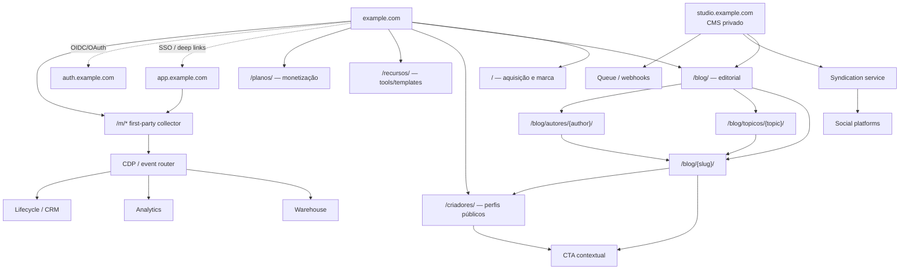

## Resumo executivo

Para um ecossistema social full-stack orientado por creators, o blog não deve ser tratado como um site editorial isolado. Ele deve funcionar como **camada pública de aquisição, descoberta, autoridade e ativação** do mesmo grafo de usuários, creators, tópicos e produtos que existe no restante da plataforma. Em 2026, isso favorece uma arquitetura em que o conteúdo editorial público permanece no **domínio principal**, enquanto runtimes com requisitos distintos — aplicação autenticada, CMS administrativo, mídia e eventualmente publicação multi-tenant — são separados por subdomínios ou endpoints próprios. O Google recomenda URLs simples, descritivas e rastreáveis; para suas experiências de IA, continua afirmando que não há um conjunto paralelo de requisitos técnicos além das boas práticas normais de Search. [^fonte-1]

**Recomendação principal:**

```text
https://example.com/                     # site público / aquisição
https://example.com/blog/                # hub editorial
https://example.com/blog/{slug}/         # artigos canônicos
https://example.com/blog/topicos/{slug}/ # hubs editoriais curados
https://example.com/criadores/{handle}/  # perfis públicos
https://example.com/recursos/{slug}/     # tools/templates/lead magnets
https://example.com/planos/              # monetização
https://app.example.com/                 # produto autenticado
https://auth.example.com/                # plano de identidade, se necessário
https://studio.example.com/              # CMS/editorial, privado
https://media.example.com/               # mídia, opcional
```

O ponto central é **não mover `blog` para `blog.example.com` sem necessidade operacional real**. Isso não se baseia em alegar que o Google concede um “bônus de ranking” a subpastas — não há base oficial para tal simplificação —, mas na vantagem arquitetural de manter navegação, mensuração, identidade de marca, links internos, conversão e governança editorial no mesmo espaço público. Subdomínios devem representar **fronteiras de runtime, segurança ou tenancy**, e não categorias de conteúdo.

Para o lançamento, recomendo **single-tenant editorial + estrutura preparada para multi-tenancy**, não um CMS multi-tenant desde o primeiro dia. O blog corporativo, autores editoriais e taxonomia pertencem a um tenant lógico da plataforma; publicação autônoma de creators entra depois, usando modelo de dados explicitamente multi-tenant e, quando necessário, subdomínios/custom domains. WordPress Multisite, por exemplo, suporta redes de sites e mapeamento de domínios, mas introduzir essa abstração antes de existir a necessidade de sites editoriais independentes aumenta a superfície operacional. [^fonte-2]

Para CMS, a escolha-base seria **Sanity + frontend React/Next.js ou equivalente**, quando conteúdo estruturado, reutilização multicanal e syndication forem estratégicos. O Sanity Content Lake armazena conteúdo como dados estruturados, consultáveis e referenciáveis, e oferece webhooks, drafts e controle de acesso — propriedades especialmente úteis para transformar um único conteúdo-fonte em página web, newsletter, snippets sociais e objetos do produto. [^fonte-3] Para uma organização enterprise com forte governança SaaS, Contentful é alternativa natural; para controle de infraestrutura, Strapi; para uma equipe editorial muito dependente do ecossistema WordPress ou uma migração incremental, WordPress híbrido continua sendo uma solução pragmática. [^fonte-4]

A mensuração deve ser concebida como **produto de dados**, não como uma coleção de pageviews. A arquitetura recomendada é:

```text
browser/app
   ↓
consent + identity context
   ↓
first-party event collector
   ↓
server-side routing / CDP
   ├── warehouse
   ├── GA4
   ├── lifecycle/CRM
   └── advertising destinations, conforme base legal/consentimento
```

O Google documenta que server-side tagging pode melhorar desempenho, controles de privacidade e qualidade dos dados e recomenda contexto first-party/same-origin para o tagging server. Isso, porém, **não substitui consentimento, base legal ou minimização de dados**. [^fonte-5]

No plano de SEO, o modelo deve privilegiar páginas estáveis, links internos semânticos, authorship verificável, `Article`/`ProfilePage`, canonicals autocanônicos, sitemaps e, somente quando houver versões realmente localizadas, `hreflang`. Para páginas de creators, `ProfilePage` é particularmente relevante: o Google o define explicitamente para sites em que pessoas ou organizações compartilham perspectivas próprias, inclusive plataformas sociais e páginas de autores. [^fonte-6]

A tese arquitetural pode ser condensada assim:

> **Domínio principal para aquisição e entidades públicas; subdomínios para fronteiras técnicas; CMS estruturado como source of truth; identidade única; tracking first-party; URLs estáveis e independentes de taxonomias voláteis; multi-tenancy apenas onde creators realmente controlarem seus próprios espaços.**

## Premissas, objetivos de aquisição e públicos

### Contrato e premissas da análise

| Campo | Definição |
|---|---|
| **VERSION** | `1.0` |
| **AREA** | Growth / Content / SEO / Platform Architecture |
| **WORKFLOW** | Research → Architecture → Implementation blueprint |
| **OWNER** | A DEFINIR |
| **STATUS** | Recomendação arquitetural |
| **Cenário** | Ecossistema social full-stack creator-led lançando blog como canal de aquisição |
| **Geografia inicial** | **Assumida:** Brasil / pt-BR, com possibilidade de internacionalização |
| **Orçamento** | A DEFINIR |
| **Stack atual** | A DEFINIR |
| **Volume editorial** | A DEFINIR |
| **Volume de creators** | A DEFINIR |
| **Legacy blog** | Assume-se que pode existir e que URLs/backlinks precisam ser preservados |

A arquitetura assume quatro grupos de público, porque “creator” isoladamente é granularidade insuficiente para desenhar jornadas de aquisição:

| Persona | Intenção típica na chegada | Conversão de valor | Conteúdo prioritário |
|---|---|---|---|
| **Creator emergente** | aprender a criar, crescer e monetizar | cadastro → primeiro conteúdo → primeiro follower | guias, templates, ferramentas, benchmarks |
| **Creator profissional** | eficiência, distribuição, analytics, monetização | signup → integração → publicação/monetização | playbooks, estudos, produto, comparativos |
| **Equipe/agência/marca** | operar creators, campanhas e workflow | lead qualificado → workspace/contrato | benchmarks, casos, dados, integrações |
| **Follower/fã** | descobrir creators e conteúdo | signup → follow → retenção/compra | perfis, tendências, coleções, discovery |

Essas personas são uma hipótese de produto, não dados observados. Devem ser substituídas por segmentos reais quando houver pesquisa de usuários e comportamento de aquisição.

### O que o blog precisa adquirir

O objetivo não deve ser simplesmente “tráfego orgânico”. A cadeia econômica recomendada é:

```text
impressão/search/social
        ↓
visita de conteúdo
        ↓
engajamento qualificado
        ↓
identificação de intenção
        ↓
cadastro
        ↓
ativação no ecossistema
        ↓
retenção
        ↓
monetização / network effects
```

Consequentemente, o north star de aquisição do blog deve aproximar-se de **activated users ou activated creators originados/assistidos por conteúdo**, não sessões. Search Console e GA4 continuam úteis em estágios distintos dessa cadeia, mas o modelo de eventos próprio precisa ligar o conteúdo ao comportamento posterior no produto. O Measurement Protocol do GA4 permite complementar o tracking convencional com eventos server-to-server e offline; a documentação é explícita em dizer que ele deve complementar, e não substituir, a coleta normal via tag/Tag Manager/Firebase. [^fonte-7]

KPIs recomendados:

| Camada | KPI de decisão |
|---|---|
| Descoberta | impressões e cliques orgânicos não-brand; CTR; páginas indexadas válidas |
| Qualidade | engaged content sessions; scroll qualificado; navegação para segundo conteúdo |
| Captura | newsletter signup rate; account signup rate; lead magnet completion |
| Produto | signup → ativação; conexão de canal; primeiro post; primeiro follow |
| Network effect | creator discovered → followed; conteúdo → profile visit |
| Receita | subscriber conversion; GMV/revenue/take rate atribuída ou assistida |
| Eficiência | CAC de conteúdo; revenue/LTV por cohort de origem; custo editorial por activated user |

Para 2026, não há justificativa para criar uma arquitetura separada de “SEO para IA” baseada em artefatos não requeridos pelo Google. A orientação oficial para AI Overviews e AI Mode continua sendo: conteúdo rastreável, indexável, útil, boa experiência de página, links internos e dados estruturados coerentes com o conteúdo visível. [^fonte-8]

## Topologias recomendadas e matriz de decisão

### Arquitetura preferencial



O CMS alimenta páginas web e syndication como saídas de uma mesma camada estruturada. Esse desenho se encaixa particularmente bem em CMSs que tratam conteúdo como dados estruturados e disponibilizam webhooks/APIs, como Sanity e Contentful. [^fonte-9]

### Alternativas de topologia

| Topologia | Exemplo | Vantagens | Desvantagens | Uso recomendado |
|---|---|---|---|---|
| **Domínio público unificado + app separado** | `example.com/blog/*`, `example.com/criadores/*`, `app.example.com` | IA pública coesa; links internos simples; atribuição e navegação integradas; runtime do produto isolável | exige integração entre web pública e app | **Padrão recomendado** |
| **Tudo no mesmo origin/path** | `example.com/blog/*`, `example.com/feed/*`, `example.com/settings/*` | máxima continuidade de cookies/rotas e design system | forte acoplamento entre conteúdo e produto; deployments podem ficar interdependentes | produto/web com uma única plataforma frontend |
| **Blog em subdomínio** | `blog.example.com/*` | isolamento de deploy/CMS/equipe; migração simples em alguns legados | navegação, medição e governança ficam mais fragmentadas; mais uma propriedade operacional | somente quando isolamento existente for caro de remover |
| **Sites por creator em subdomínios** | `{creator}.example.com/*` | forte fronteira de tenancy e personalização | wildcard DNS/TLS, moderação, abuso, canonicalização e analytics ficam mais complexos | publicação autônoma de creators, fase posterior |
| **Custom domains por creator** | `creator-owned-domain.com` | propriedade de marca pelo creator | maior complexidade de TLS, domínio, SEO duplicado, analytics e suporte | feature premium/madura |
| **Rede WordPress Multisite** | subpastas/subdomínios/domínios | administração compartilhada de vários sites | maior acoplamento de upgrades/plugins e modelo específico de WordPress | rede editorial genuinamente independente |

WordPress Multisite suporta redes em paths/subdomínios e mapeamento de domínios, portanto é uma solução real para redes editoriais; isso não significa que seja o modelo correto para um único blog de aquisição. [^fonte-10]

### Matriz de decisão

Pontuação abaixo é **avaliação arquitetural deste relatório**, em escala de 1–5. Ela não representa um ranking publicado pelos fornecedores.

| Critério | Peso | Público unificado + `app.` | Tudo em paths | `blog.` isolado | Multi-tenant creator sites |
|---|---:|---:|---:|---:|---:|
| Aquisição/SEO | 25% | **5** | 5 | 3 | 3 |
| Conversão para produto | 20% | **5** | 5 | 3 | 4 |
| Isolamento operacional | 15% | 4 | 2 | **5** | 5 |
| Escalabilidade de conteúdo | 15% | **5** | 4 | 4 | 5 |
| Complexidade inicial | 10% | **4** | 4 | 4 | 1 |
| Segurança/tenancy | 10% | 4 | 3 | 4 | **5** |
| Internacionalização | 5% | **5** | 5 | 4 | 4 |
| **Score ponderado** | | **4,65** | 4,05 | 3,65 | 3,70 |

**Decisão:** usar domínio principal para todas as entidades públicas e indexáveis da plataforma, separando o produto autenticado em `app.`. O Google recomenda estruturas de URL simples e lógicas, inclusive subdiretórios quando se precisa segmentar versões regionais; a escolha entre subpasta e subdomínio aqui é, portanto, uma decisão de arquitetura e governança, não uma alegação de “SEO juice” automático. [^fonte-11]

### Single-tenant versus multi-tenant

O blog deve começar **single-tenant no plano editorial**:

```text
Editorial tenant
├── posts
├── topics
├── authors
├── campaigns
├── resources
└── landing_pages
```

A camada de creators pode evoluir independentemente:

```text
Platform
├── tenant: editorial
│   └── branded content
├── tenant: creator_123
│   ├── profile
│   └── publications
├── tenant: creator_456
│   ├── profile
│   └── publications
└── ...
```

Em um futuro modelo multi-tenant, cada documento deve carregar identificadores de tenant e owner, e a autorização precisa ser aplicada no backend/API — nunca somente pela rota ou pelo frontend. `ProfilePage` permite representar tanto pessoas quanto organizações e até recomenda um `identifier` interno separado do handle público, o que é útil quando usernames mudam. [^fonte-12]

**Regra de arquitetura:** *multi-tenant data model ≠ multi-domain SEO model*. É perfeitamente válido armazenar milhões de creators em tenancy lógica e publicar todos sob `example.com/criadores/{handle}`.

## Arquitetura de informação, URLs e SEO técnico

### Estrutura concreta de diretórios

A topologia pública recomendada é deliberadamente rasa:

```text
/
├── blog/
│   ├── {article-slug}/
│   ├── topicos/
│   │   ├── criar/
│   │   ├── crescer/
│   │   ├── engajar/
│   │   ├── monetizar/
│   │   └── operar/
│   └── autores/
│       └── {author-slug}/
│
├── criadores/
│   └── {creator-handle}/
│
├── recursos/
│   ├── calculadoras/
│   ├── templates/
│   └── benchmarks/
│
├── newsletter/
├── sobre/
├── planos/
├── entrar/
├── cadastro/
├── privacidade/
├── cookies/
└── termos/
```

Google recomenda palavras legíveis e descritivas nas URLs, linguagem compreensível ao público e uma estrutura simples; URLs excessivamente parametrizadas podem criar espaços de crawling desnecessários. [^fonte-13]

### Por que não colocar a categoria no artigo

O padrão recomendado é:

```text
https://example.com/blog/como-monetizar-audiencia/
```

em vez de:

```text
https://example.com/blog/monetizacao/creator/instagram/como-monetizar-audiencia/
```

A categoria deve ser uma **relação de conteúdo**, não necessariamente parte da identidade do documento. Isso permite mover um artigo de “crescer” para “monetizar” sem mudar sua URL. A recomendação decorre do princípio de manter URLs simples e estáveis e reduz custos futuros de redirects. [^fonte-14]

Um modelo de conteúdo possível:

```yaml
article:
  id: "cnt_01..."
  slug: "como-monetizar-audiencia"
  title: "..."
  primary_topic: "monetizar"
  secondary_topics:
    - "assinaturas"
    - "comunidade"
  personas:
    - "creator-pro"
  journey_stage: "consideration"
  content_format: "guide"
  author_id: "usr_..."
  featured_creators:
