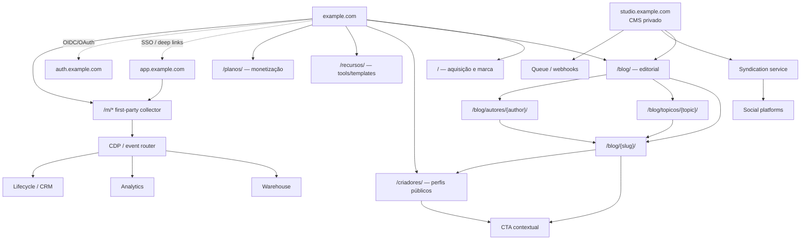
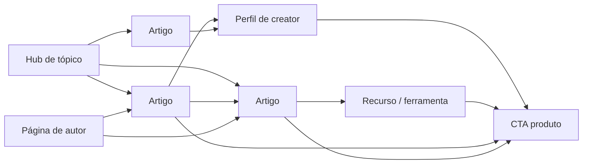
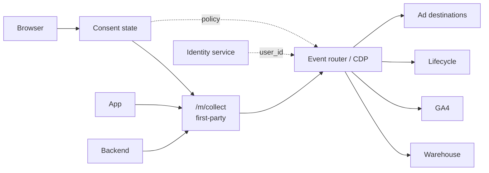

## Resumo executivo

Para um ecossistema social full-stack orientado por creators, o blog não deve ser tratado como um site editorial isolado. Ele deve funcionar como **camada pública de aquisição, descoberta, autoridade e ativação** do mesmo grafo de usuários, creators, tópicos e produtos que existe no restante da plataforma. Em 2026, isso favorece uma arquitetura em que o conteúdo editorial público permanece no **domínio principal**, enquanto runtimes com requisitos distintos — aplicação autenticada, CMS administrativo, mídia e eventualmente publicação multi-tenant — são separados por subdomínios ou endpoints próprios. O Google recomenda URLs simples, descritivas e rastreáveis; para suas experiências de IA, continua afirmando que não há um conjunto paralelo de requisitos técnicos além das boas práticas normais de Search. [^fonte-1]

**Recomendação principal:**

```text
https://example.com/                     # site público / aquisição
https://example.com/blog/                # hub editorial
https://example.com/blog/{slug}/         # artigos canônicos
https://example.com/blog/topicos/{slug}/ # hubs editoriais curados
https://example.com/criadores/{handle}/  # perfis públicos
https://example.com/recursos/{slug}/     # tools/templates/lead magnets
https://example.com/planos/              # monetização
https://app.example.com/                 # produto autenticado
https://auth.example.com/                # plano de identidade, se necessário
https://studio.example.com/              # CMS/editorial, privado
https://media.example.com/               # mídia, opcional
```

O ponto central é **não mover `blog` para `blog.example.com` sem necessidade operacional real**. Isso não se baseia em alegar que o Google concede um “bônus de ranking” a subpastas — não há base oficial para tal simplificação —, mas na vantagem arquitetural de manter navegação, mensuração, identidade de marca, links internos, conversão e governança editorial no mesmo espaço público. Subdomínios devem representar **fronteiras de runtime, segurança ou tenancy**, e não categorias de conteúdo.

Para o lançamento, recomendo **single-tenant editorial + estrutura preparada para multi-tenancy**, não um CMS multi-tenant desde o primeiro dia. O blog corporativo, autores editoriais e taxonomia pertencem a um tenant lógico da plataforma; publicação autônoma de creators entra depois, usando modelo de dados explicitamente multi-tenant e, quando necessário, subdomínios/custom domains. WordPress Multisite, por exemplo, suporta redes de sites e mapeamento de domínios, mas introduzir essa abstração antes de existir a necessidade de sites editoriais independentes aumenta a superfície operacional. [^fonte-2]

Para CMS, a escolha-base seria **Sanity + frontend React/Next.js ou equivalente**, quando conteúdo estruturado, reutilização multicanal e syndication forem estratégicos. O Sanity Content Lake armazena conteúdo como dados estruturados, consultáveis e referenciáveis, e oferece webhooks, drafts e controle de acesso — propriedades especialmente úteis para transformar um único conteúdo-fonte em página web, newsletter, snippets sociais e objetos do produto. [^fonte-3] Para uma organização enterprise com forte governança SaaS, Contentful é alternativa natural; para controle de infraestrutura, Strapi; para uma equipe editorial muito dependente do ecossistema WordPress ou uma migração incremental, WordPress híbrido continua sendo uma solução pragmática. [^fonte-4]

A mensuração deve ser concebida como **produto de dados**, não como uma coleção de pageviews. A arquitetura recomendada é:

```text
browser/app
   ↓
consent + identity context
   ↓
first-party event collector
   ↓
server-side routing / CDP
   ├── warehouse
   ├── GA4
   ├── lifecycle/CRM
   └── advertising destinations, conforme base legal/consentimento
```

O Google documenta que server-side tagging pode melhorar desempenho, controles de privacidade e qualidade dos dados e recomenda contexto first-party/same-origin para o tagging server. Isso, porém, **não substitui consentimento, base legal ou minimização de dados**. [^fonte-5]

No plano de SEO, o modelo deve privilegiar páginas estáveis, links internos semânticos, authorship verificável, `Article`/`ProfilePage`, canonicals autocanônicos, sitemaps e, somente quando houver versões realmente localizadas, `hreflang`. Para páginas de creators, `ProfilePage` é particularmente relevante: o Google o define explicitamente para sites em que pessoas ou organizações compartilham perspectivas próprias, inclusive plataformas sociais e páginas de autores. [^fonte-6]

A tese arquitetural pode ser condensada assim:

> **Domínio principal para aquisição e entidades públicas; subdomínios para fronteiras técnicas; CMS estruturado como source of truth; identidade única; tracking first-party; URLs estáveis e independentes de taxonomias voláteis; multi-tenancy apenas onde creators realmente controlarem seus próprios espaços.**

## Premissas, objetivos de aquisição e públicos

### Contrato e premissas da análise

| Campo | Definição |
|---|---|
| **VERSION** | `1.0` |
| **AREA** | Growth / Content / SEO / Platform Architecture |
| **WORKFLOW** | Research → Architecture → Implementation blueprint |
| **OWNER** | A DEFINIR |
| **STATUS** | Recomendação arquitetural |
| **Cenário** | Ecossistema social full-stack creator-led lançando blog como canal de aquisição |
| **Geografia inicial** | **Assumida:** Brasil / pt-BR, com possibilidade de internacionalização |
| **Orçamento** | A DEFINIR |
| **Stack atual** | A DEFINIR |
| **Volume editorial** | A DEFINIR |
| **Volume de creators** | A DEFINIR |
| **Legacy blog** | Assume-se que pode existir e que URLs/backlinks precisam ser preservados |

A arquitetura assume quatro grupos de público, porque “creator” isoladamente é granularidade insuficiente para desenhar jornadas de aquisição:

| Persona | Intenção típica na chegada | Conversão de valor | Conteúdo prioritário |
|---|---|---|---|
| **Creator emergente** | aprender a criar, crescer e monetizar | cadastro → primeiro conteúdo → primeiro follower | guias, templates, ferramentas, benchmarks |
| **Creator profissional** | eficiência, distribuição, analytics, monetização | signup → integração → publicação/monetização | playbooks, estudos, produto, comparativos |
| **Equipe/agência/marca** | operar creators, campanhas e workflow | lead qualificado → workspace/contrato | benchmarks, casos, dados, integrações |
| **Follower/fã** | descobrir creators e conteúdo | signup → follow → retenção/compra | perfis, tendências, coleções, discovery |

Essas personas são uma hipótese de produto, não dados observados. Devem ser substituídas por segmentos reais quando houver pesquisa de usuários e comportamento de aquisição.

### O que o blog precisa adquirir

O objetivo não deve ser simplesmente “tráfego orgânico”. A cadeia econômica recomendada é:

```text
impressão/search/social
        ↓
visita de conteúdo
        ↓
engajamento qualificado
        ↓
identificação de intenção
        ↓
cadastro
        ↓
ativação no ecossistema
        ↓
retenção
        ↓
monetização / network effects
```

Consequentemente, o north star de aquisição do blog deve aproximar-se de **activated users ou activated creators originados/assistidos por conteúdo**, não sessões. Search Console e GA4 continuam úteis em estágios distintos dessa cadeia, mas o modelo de eventos próprio precisa ligar o conteúdo ao comportamento posterior no produto. O Measurement Protocol do GA4 permite complementar o tracking convencional com eventos server-to-server e offline; a documentação é explícita em dizer que ele deve complementar, e não substituir, a coleta normal via tag/Tag Manager/Firebase. [^fonte-7]

KPIs recomendados:

| Camada | KPI de decisão |
|---|---|
| Descoberta | impressões e cliques orgânicos não-brand; CTR; páginas indexadas válidas |
| Qualidade | engaged content sessions; scroll qualificado; navegação para segundo conteúdo |
| Captura | newsletter signup rate; account signup rate; lead magnet completion |
| Produto | signup → ativação; conexão de canal; primeiro post; primeiro follow |
| Network effect | creator discovered → followed; conteúdo → profile visit |
| Receita | subscriber conversion; GMV/revenue/take rate atribuída ou assistida |
| Eficiência | CAC de conteúdo; revenue/LTV por cohort de origem; custo editorial por activated user |

Para 2026, não há justificativa para criar uma arquitetura separada de “SEO para IA” baseada em artefatos não requeridos pelo Google. A orientação oficial para AI Overviews e AI Mode continua sendo: conteúdo rastreável, indexável, útil, boa experiência de página, links internos e dados estruturados coerentes com o conteúdo visível. [^fonte-8]

## Topologias recomendadas e matriz de decisão

### Arquitetura preferencial



O CMS alimenta páginas web e syndication como saídas de uma mesma camada estruturada. Esse desenho se encaixa particularmente bem em CMSs que tratam conteúdo como dados estruturados e disponibilizam webhooks/APIs, como Sanity e Contentful. [^fonte-9]

### Alternativas de topologia

| Topologia | Exemplo | Vantagens | Desvantagens | Uso recomendado |
|---|---|---|---|---|
| **Domínio público unificado + app separado** | `example.com/blog/*`, `example.com/criadores/*`, `app.example.com` | IA pública coesa; links internos simples; atribuição e navegação integradas; runtime do produto isolável | exige integração entre web pública e app | **Padrão recomendado** |
| **Tudo no mesmo origin/path** | `example.com/blog/*`, `example.com/feed/*`, `example.com/settings/*` | máxima continuidade de cookies/rotas e design system | forte acoplamento entre conteúdo e produto; deployments podem ficar interdependentes | produto/web com uma única plataforma frontend |
| **Blog em subdomínio** | `blog.example.com/*` | isolamento de deploy/CMS/equipe; migração simples em alguns legados | navegação, medição e governança ficam mais fragmentadas; mais uma propriedade operacional | somente quando isolamento existente for caro de remover |
| **Sites por creator em subdomínios** | `{creator}.example.com/*` | forte fronteira de tenancy e personalização | wildcard DNS/TLS, moderação, abuso, canonicalização e analytics ficam mais complexos | publicação autônoma de creators, fase posterior |
| **Custom domains por creator** | `creator-owned-domain.com` | propriedade de marca pelo creator | maior complexidade de TLS, domínio, SEO duplicado, analytics e suporte | feature premium/madura |
| **Rede WordPress Multisite** | subpastas/subdomínios/domínios | administração compartilhada de vários sites | maior acoplamento de upgrades/plugins e modelo específico de WordPress | rede editorial genuinamente independente |

WordPress Multisite suporta redes em paths/subdomínios e mapeamento de domínios, portanto é uma solução real para redes editoriais; isso não significa que seja o modelo correto para um único blog de aquisição. [^fonte-10]

### Matriz de decisão

Pontuação abaixo é **avaliação arquitetural deste relatório**, em escala de 1–5. Ela não representa um ranking publicado pelos fornecedores.

| Critério | Peso | Público unificado + `app.` | Tudo em paths | `blog.` isolado | Multi-tenant creator sites |
|---|---:|---:|---:|---:|---:|
| Aquisição/SEO | 25% | **5** | 5 | 3 | 3 |
| Conversão para produto | 20% | **5** | 5 | 3 | 4 |
| Isolamento operacional | 15% | 4 | 2 | **5** | 5 |
| Escalabilidade de conteúdo | 15% | **5** | 4 | 4 | 5 |
| Complexidade inicial | 10% | **4** | 4 | 4 | 1 |
| Segurança/tenancy | 10% | 4 | 3 | 4 | **5** |
| Internacionalização | 5% | **5** | 5 | 4 | 4 |
| **Score ponderado** | | **4,65** | 4,05 | 3,65 | 3,70 |

**Decisão:** usar domínio principal para todas as entidades públicas e indexáveis da plataforma, separando o produto autenticado em `app.`. O Google recomenda estruturas de URL simples e lógicas, inclusive subdiretórios quando se precisa segmentar versões regionais; a escolha entre subpasta e subdomínio aqui é, portanto, uma decisão de arquitetura e governança, não uma alegação de “SEO juice” automático. [^fonte-11]

### Single-tenant versus multi-tenant

O blog deve começar **single-tenant no plano editorial**:

```text
Editorial tenant
├── posts
├── topics
├── authors
├── campaigns
├── resources
└── landing_pages
```

A camada de creators pode evoluir independentemente:

```text
Platform
├── tenant: editorial
│   └── branded content
├── tenant: creator_123
│   ├── profile
│   └── publications
├── tenant: creator_456
│   ├── profile
│   └── publications
└── ...
```

Em um futuro modelo multi-tenant, cada documento deve carregar identificadores de tenant e owner, e a autorização precisa ser aplicada no backend/API — nunca somente pela rota ou pelo frontend. `ProfilePage` permite representar tanto pessoas quanto organizações e até recomenda um `identifier` interno separado do handle público, o que é útil quando usernames mudam. [^fonte-12]

**Regra de arquitetura:** *multi-tenant data model ≠ multi-domain SEO model*. É perfeitamente válido armazenar milhões de creators em tenancy lógica e publicar todos sob `example.com/criadores/{handle}`.

## Arquitetura de informação, URLs e SEO técnico

### Estrutura concreta de diretórios

A topologia pública recomendada é deliberadamente rasa:

```text
/
├── blog/
│   ├── {article-slug}/
│   ├── topicos/
│   │   ├── criar/
│   │   ├── crescer/
│   │   ├── engajar/
│   │   ├── monetizar/
│   │   └── operar/
│   └── autores/
│       └── {author-slug}/
│
├── criadores/
│   └── {creator-handle}/
│
├── recursos/
│   ├── calculadoras/
│   ├── templates/
│   └── benchmarks/
│
├── newsletter/
├── sobre/
├── planos/
├── entrar/
├── cadastro/
├── privacidade/
├── cookies/
└── termos/
```

Google recomenda palavras legíveis e descritivas nas URLs, linguagem compreensível ao público e uma estrutura simples; URLs excessivamente parametrizadas podem criar espaços de crawling desnecessários. [^fonte-13]

### Por que não colocar a categoria no artigo

O padrão recomendado é:

```text
https://example.com/blog/como-monetizar-audiencia/
```

em vez de:

```text
https://example.com/blog/monetizacao/creator/instagram/como-monetizar-audiencia/
```

A categoria deve ser uma **relação de conteúdo**, não necessariamente parte da identidade do documento. Isso permite mover um artigo de “crescer” para “monetizar” sem mudar sua URL. A recomendação decorre do princípio de manter URLs simples e estáveis e reduz custos futuros de redirects. [^fonte-14]

Um modelo de conteúdo possível:

```yaml
article:
  id: "cnt_01..."
  slug: "como-monetizar-audiencia"
  title: "..."
  primary_topic: "monetizar"
  secondary_topics:
    - "assinaturas"
    - "comunidade"
  personas:
    - "creator-pro"
  journey_stage: "consideration"
  content_format: "guide"
  author_id: "usr_..."
  featured_creators:
    - "creator_..."
  locale: "pt-BR"
  canonical_url: "..."
  published_at: "..."
  updated_at: "..."
  schema_version: 3
```

### Taxonomia recomendada

A taxonomia deve separar dimensões que frequentemente são misturadas:

| Dimensão | Exemplos | Deve gerar URL indexável? |
|---|---|---|
| **Job-to-be-done/pilar** | criar, crescer, engajar, monetizar, operar | **Sim**, se houver hub curado |
| Persona | iniciante, creator pro, agência, follower | geralmente não |
| Formato | guia, estudo, entrevista, benchmark | só se houver volume/intenção |
| Plataforma/canal | Instagram, YouTube, TikTok etc. | somente hubs com demanda e conteúdo suficientes |
| Vertical | música, gaming, educação, beleza | conforme estratégia |
| Funil | awareness, consideration, activation | não |
| Tags livres | termos editoriais | **não por padrão** |

O risco a evitar é criar automaticamente centenas de archives finos. Uma tag só deve virar landing page indexável quando puder funcionar como **destino editorial real**, com introdução, seleção e links próprios.

### Link graph

A arquitetura deve ser pensada como um grafo:



Cada artigo deve ter um caminho editorial claro para um hub, autor, conteúdos relacionados e próximo passo de produto. Além de ajudar usuários, links internos são parte do mecanismo de descoberta e entendimento do site pelos mecanismos de busca; por isso, eles devem ser links HTML rastreáveis com anchors descritivos, não navegação dependente apenas de handlers JavaScript.

### Canonicalização

Cada página editorial original deve emitir canonical autocanônico:

```html
<link
  rel="canonical"
  href="https://example.com/blog/como-crescer-comunidade/"
/>
```

O Google considera redirects e `rel="canonical"` sinais fortes de canonicalização e sitemap um sinal mais fraco; combinar sinais consistentes é preferível. Links internos também devem apontar diretamente para a versão canônica. [^fonte-15]

Portanto:

```text
/blog/post?utm_source=linkedin
/blog/post?ref=creator123
/blog/post?campaign=launch
```

devem continuar com:

```text
canonical → /blog/post/
```

UTMs servem para atribuição, não para criar novas identidades editoriais.

### Internacionalização e `hreflang`

Como o mercado inicial foi assumido como pt-BR, há duas opções:

**Sem internacionalização comprometida no curto prazo:**

```text
https://example.com/blog/{slug}/
```

**Internacionalização já contratada no roadmap:**

```text
https://example.com/pt-br/blog/{slug}/
https://example.com/en/blog/{slug}/
https://example.com/es/blog/{slug}/
```

Google suporta `hreflang` com código de idioma ISO 639-1 e região opcional ISO 3166-1 Alpha 2, além de `x-default` para fallback. [^fonte-16]

Exemplo:

```html
<link rel="alternate"
      hreflang="pt-BR"
      href="https://example.com/pt-br/blog/monetizacao/" />

<link rel="alternate"
      hreflang="en"
      href="https://example.com/en/blog/monetization/" />

<link rel="alternate"
      hreflang="x-default"
      href="https://example.com/blog/" />
```

Não se deve criar versões linguísticas vazias ou traduções automáticas apenas para preencher a arquitetura. Internacionalizar URLs sem capacidade editorial correspondente aumenta complexidade sem gerar o benefício pretendido.

### Structured data

O mínimo útil:

| Página | Schema |
|---|---|
| Artigo | `Article` ou subtipo adequado |
| Página de autor | `ProfilePage` + `Person` |
| Creator | `ProfilePage` + `Person`/`Organization` |
| Breadcrumb | `BreadcrumbList` |
| Entidade principal | `Organization` |
| Vídeo original | `VideoObject`, quando aplicável |

Google mantém documentação específica tanto para `Article` quanto para `ProfilePage`; para perfis, o markup pode conectar a entidade aos seus conteúdos recentes com `hasPart`, e `sameAs` pode referenciar perfis externos. [^fonte-17]

Exemplo simplificado de perfil:

```json
{
  "@context": "https://schema.org",
  "@type": "ProfilePage",
  "mainEntity": {
    "@type": "Person",
    "name": "Nome do Creator",
    "alternateName": "@creator",
    "identifier": "creator_01H...",
    "url": "https://example.com/criadores/creator/",
    "sameAs": [
      "https://social.example/creator"
    ]
  }
}
```

### Performance

Os budgets iniciais devem ser medidos com dados de usuários reais. Como referência, a documentação atual do Google recomenda LCP de até 2,5 segundos e INP abaixo de 200 ms para a faixa considerada boa; Core Web Vitals medem carregamento, responsividade e estabilidade visual. [^fonte-18]

Consequências arquiteturais:

- HTML editorial preferencialmente estático/cached ou incrementalmente regenerado;
- imagens transformadas no CDN;
- JavaScript de marketing sob orçamento;
- scripts de terceiros retardados quando não essenciais;
- conteúdo acima da dobra não deve depender de chamadas client-side lentas;
- publicação CMS deve invalidar somente as páginas afetadas, não rebuildar o universo inteiro;
- páginas de creators em grande escala devem usar rendering/cache incremental, não builds completos a cada deploy.

## Plataforma, CMS, identidade, dados e infraestrutura

### Comparação de CMS

| Opção | Modelo | Melhor cenário | Vantagens | Trade-offs | TCO relativo |
|---|---|---|---|---|---|
| **Sanity** | Headless/structured content | ecossistema multicanal e product-content | conteúdo estruturado/referenciável; GROQ/GraphQL; webhooks; bom para reutilização | requer frontend e modelagem próprios | $$ |
| **Contentful** | SaaS headless | enterprise e equipes editoriais governadas | Delivery API via CDN; Management API; workflows de conteúdo | custo SaaS e modelagem mais rígida dependendo do plano | $$–$$$ |
| **Strapi** | Headless open source/self-hostable | controle de código, dados e infraestrutura | código MIT, REST/GraphQL, backend extensível, self-host ou cloud | operação, upgrades e segurança passam mais para a equipe | $–$$$ |
| **WordPress híbrido** | monolítico + REST API | migração rápida/equipe WordPress | UX editorial madura e grande ecossistema; REST API permite frontend separado | plugins/updates e consistência arquitetural exigem disciplina | $–$$ |
| **WordPress Multisite** | rede | muitos sites editoriais independentes | administração de múltiplos sites/domínios | complexidade desnecessária para um único acquisition blog | $$ |

As capacidades centrais acima são documentadas pelos próprios produtos: Sanity posiciona conteúdo como dados estruturados para entrega a qualquer canal; Contentful fornece Delivery e Management APIs; Strapi fornece REST/GraphQL e opção self-hosted; WordPress expõe posts, páginas, taxonomias e outros objetos via REST API. [^fonte-19]

**Escolha recomendada:** Sanity/headless quando o blog será realmente a primeira superfície de uma **content platform**. WordPress híbrido vence quando o principal risco é time-to-market editorial e já existe uma organização WordPress madura.

### Topologia de código

Para frontend próprio, um monorepo reduz divergência entre SEO, analytics e design system:

```text
repo/
├── apps/
│   ├── web/                  # site público + blog
│   ├── studio/               # CMS customizado, se aplicável
│   └── event-collector/      # endpoint first-party
│
├── packages/
│   ├── design-system/
│   ├── content-schema/
│   ├── analytics-schema/
│   ├── seo/
│   ├── auth/
│   └── social-syndication/
│
├── infrastructure/
│   ├── environments/
│   ├── cdn/
│   ├── dns/
│   └── observability/
│
├── migrations/
│   ├── content/
│   └── redirects/
│
└── docs/
    ├── url-governance.md
    ├── taxonomy.md
    └── tracking-plan.md
```

URLs públicas não devem carregar versões técnicas como `/blog/v2/...`. Versionamento pertence ao schema/API/deploy:

```text
content.schema_version = 3
/api/v1/...
migrations/content/003-add-primary-topic.ts
```

### CI/CD

Pipeline recomendado:

```text
PR
 ↓
lint + typecheck
 ↓
unit/integration
 ↓
content-schema validation
 ↓
URL/canonical/hreflang tests
 ↓
JSON-LD validation
 ↓
broken-link crawl
 ↓
performance budget
 ↓
dependency/security checks
 ↓
preview deployment
 ↓
review editorial/SEO
 ↓
production
 ↓
smoke tests + telemetry
```

Dependabot pode abrir PRs para dependências vulneráveis ou desatualizadas e integrar essas atualizações ao workflow de Actions; isso deve ser apenas uma camada do programa de segurança, não seu substituto. [^fonte-20]

### Hosting e edge CDN

| Opção | Fit | Pontos fortes | Trade-offs arquiteturais | TCO provável |
|---|---|---|---|---|
| **Vercel** | Next.js / frontend-heavy | CDN integrado, cache framework-aware, ISR/SWR e previews/deploy velocity | custo cresce com uso; maior alinhamento a seu ecossistema | $$–$$$ |
| **Cloudflare** | edge-first / alto volume | Workers, CDN/cache, queues, storage e edge compute em plataforma integrada | arquitetura edge exige disciplina sobre runtimes/limites | $–$$ |
| **AWS + CloudFront** | controle/enterprise | controle granular de origins, cache policies, serviços AWS e edge | maior carga DevOps/FinOps | $$–$$$ |
| **Netlify** | JAMstack e equipes web | CDN, Functions, Edge Functions, caching e workflow integrado | adequação depende do framework e workloads dinâmicos | $$ |

Vercel documenta CDN global integrado aos deployments e caching incluindo stale-while-revalidate; Cloudflare Workers combina compute, cache/CDN, queues e storage distribuído; CloudFront usa edge locations para diminuir latência e carga do origin; Netlify permite controlar caching e executar Edge Functions. [^fonte-21]

Como o orçamento é desconhecido, **não há um vencedor absoluto de custo**. TCO precisa incluir:

```text
TCO =
  plataforma
+ bandwidth/requests
+ builds
+ CMS seats/API usage
+ observabilidade
+ dados
+ engenharia de plataforma
+ segurança
+ suporte
+ custo de oportunidade editorial
```

A escolha mais barata na fatura pode ser mais cara se exigir uma pessoa adicional de platform engineering. Da mesma forma, managed hosting mais caro pode ter TCO menor numa equipe pequena.

### Identidade e SSO

Use um único **identity plane**, mesmo que a web pública e o app tenham runtimes separados.

```text
anonymous visitor
      ↓
example.com/blog/...
      ↓ signup/login
Authorization Server
      ↓
OIDC identity
      ↓
app.example.com
      ↓
same internal user_id
```

OpenID Connect é a camada de identidade construída sobre OAuth 2.0 e permite ao cliente verificar a identidade do usuário e receber informações básicas interoperáveis; o RFC 9700 constitui a Best Current Practice atual de segurança OAuth. [^fonte-22]

Recomendação operacional:

- `user_id` interno e imutável;
- `creator_id` separado do user;
- handle público mutável;
- roles/permissions server-side;
- autenticação centralizada;
- evitar sessão privilegiada baseada em cookie wildcard compartilhado indiscriminadamente por todos os subdomínios;
- separar autenticação de autorização editorial.

A atribuição de aquisição deve sobreviver ao handoff `www → app`, mas apenas com dados necessários e dentro das regras de privacidade aplicáveis.

### Tracking e CDP

Arquitetura:



Server-side tagging oferece controles adicionais de privacidade, qualidade de dados e performance, e o Google recomenda deployment same-origin/first-party quando possível. Isso permite, por exemplo:

```text
https://example.com/m/collect
```

em vez de depender diretamente de um hostname de terceiro. [^fonte-23]

A CDP deve ser **opcional**, não pré-requisito para lançar o blog. Uma arquitetura boa permite começar com collector/event schema → warehouse/GA4 e encaixar um CDP quando existirem casos concretos de audience activation, journey orchestration ou reverse ETL.

### Taxonomia de eventos

Convenção: `object_action`, nomes em `snake_case`, eventos no passado para fatos consumados e IDs estáveis.

| Evento | Momento | Propriedades específicas | Valor |
|---|---|---|---|
| `content_viewed` | conteúdo realmente renderizado | `content_id`, `content_type`, `topic` | alcance |
| `content_engaged` | engagement threshold definido | `engagement_ms`, `scroll_depth` | qualidade |
| `content_cta_clicked` | CTA | `cta_id`, `cta_type`, `placement` | intenção |
| `creator_profile_viewed` | visita ao creator | `creator_id`, `source_content_id` | discovery |
| `creator_followed` | follow concluído | `creator_id` | network effect |
| `social_share_clicked` | share iniciado | `platform`, `content_id` | distribuição |
| `newsletter_signup_completed` | inscrição confirmada | `form_id` | captura |
| `account_signup_started` | início | `persona_hint` | funnel |
| `account_signup_completed` | conta criada | `user_id` | aquisição |
| `creator_activation_completed` | activation criterion | `creator_id` | KPI principal |
| `channel_connected` | integração social | `channel_type` | activation |
| `first_content_published` | primeiro post | `creator_id` | activation |
| `subscription_started` | monetização | `plan_id` | receita |
| `purchase_completed` | compra | `order_id`, `value`, `currency` | receita |
| `affiliate_link_clicked` | outbound monetizado | `partner_id`, `offer_id` | affiliate |

Envelope comum:

```json
{
  "event": "content_cta_clicked",
  "event_id": "evt_...",
  "occurred_at": "2026-09-24T18:30:00Z",
  "anonymous_id": "anon_...",
  "user_id": null,
  "session_id": "ses_...",
  "consent_state": {
    "analytics": true,
    "advertising": false
  },
  "page": {
    "canonical_url": "...",
    "locale": "pt-BR"
  },
  "content": {
    "id": "cnt_...",
    "type": "guide",
    "primary_topic": "monetizar"
  },
  "acquisition": {
    "utm_source": "linkedin",
    "utm_medium": "organic_social",
    "utm_campaign": "creator-monetization-q3",
    "utm_content": "carousel-01"
  }
}
```

Google recomenda que URLs de campanha incluam consistentemente `utm_source`, `utm_medium` e `utm_campaign`; os valores são case-sensitive, o que reforça a necessidade de uma nomenclatura governada. [^fonte-24]

Padrão:

```text
utm_source      = instagram | tiktok | youtube | linkedin | newsletter | partner
utm_medium      = organic_social | paid_social | email | referral | cpc
utm_campaign    = {initiative}-{yyyyq#}
utm_content     = {asset-or-placement}
utm_id          = {internal-campaign-id}
```

**Nunca use UTM em links internos.** Links internos devem preservar a atribuição via estado/eventos próprios; UTMs internos sobrescrevem ou confundem a origem da sessão.

### Syndication para redes sociais

Fluxo recomendado:

```text
CMS publish
   ↓
webhook
   ↓
queue
   ↓
content transformer
   ├── canonical web article
   ├── short social excerpt
   ├── carousel script
   ├── video/short script
   ├── newsletter abstract
   └── in-app object
          ↓
platform adapters
          ↓
store external_post_id + status + URL
```

O **artigo permanece source of truth**. Cada plataforma recebe uma transformação apropriada, não simplesmente uma cópia indiscriminada do HTML.

O registro de syndication deve guardar:

```yaml
syndication:
  source_content_id: cnt_123
  channel: linkedin
  variant_id: v_04
  external_post_id: "..."
  campaign_id: "..."
  published_at: "..."
  status: published
```

Backlinks sociais devem usar UTMs padronizados. O CMS deve ser desacoplado das APIs de plataformas por adapters + queue, para que uma mudança ou falha em uma rede não bloqueie publicação no site.

### Monetização

O grafo de conteúdo deve suportar múltiplos caminhos sem contaminar a taxonomia editorial:

```text
SEO article
 ├── creator signup
 ├── follower signup
 ├── premium plan
 ├── creator membership
 ├── marketplace/brand deal
 ├── affiliate offer
 ├── sponsorship
 └── product/tool
```

Cada caminho deve ter `offer_id`, `placement_id` e eventos específicos, permitindo medir receita por conteúdo sem transformar todas as páginas em landing pages agressivas.

## Privacidade, segurança e governança

### LGPD e GDPR

A LGPD se aplica ao tratamento de dados pessoais inclusive em meios digitais e define tratamento de maneira ampla. Também exige princípios como necessidade, segurança, prevenção, transparência e responsabilização; consentimento, quando usado, deve ser livre, informado, inequívoco e ligado a finalidade determinada. A lei consolidada disponível em setembro de 2026 já incorpora alterações de 2026, inclusive na definição do encarregado. [^fonte-25]

Por isso, o tracking plan precisa conter um **data-processing register**, não somente um spreadsheet de eventos:

| Campo | Exemplo |
|---|---|
| dado/evento | `content_viewed` |
| finalidade | analytics de produto |
| controlador | A DEFINIR |
| processador/vendor | A DEFINIR |
| base legal | definir com jurídico/DPO |
| consent category | analytics, se aplicável |
| retenção | A DEFINIR |
| destino | warehouse/GA4 |
| região | A DEFINIR |
| contém identificador? | sim/não |
| exclusão/DSR | procedimento definido |

