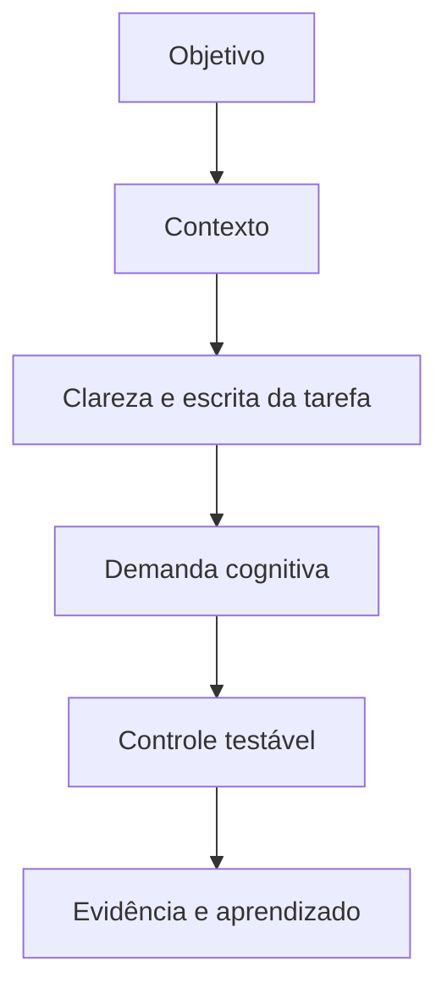
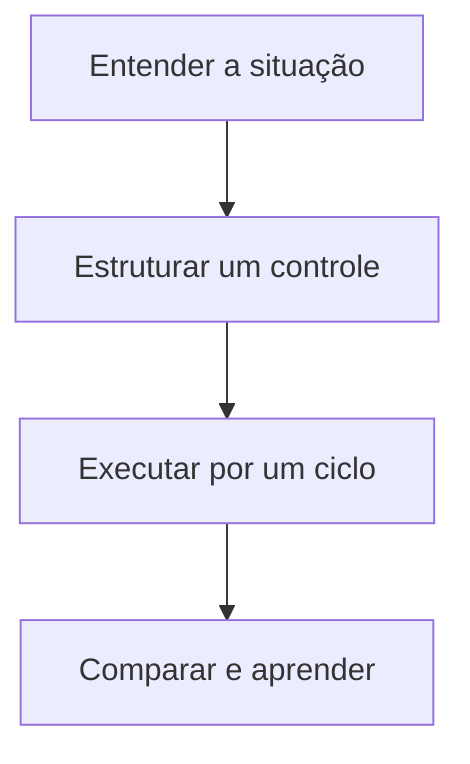

> [!summary] Frase-síntese
> Tarefa ambígua adia a decisão para a execução. — síntese a partir de W3C COGA

## 1. Origem

**Termo.** Clareza e escrita da tarefa.  
**Significado.** Condição da execução que merece observação e controle.  
**Etimologia.** Clareza vem do latim clarus, luminoso ou evidente. Escrever uma tarefa com clareza é tornar ação, objeto, resultado e conclusão reconhecíveis antes do início.

## 2. Contexto

“Organizar apresentação” pode significar revisar texto, imagens, ordem, referências ou envio. Cada retomada exige nova interpretação. O fator não caracteriza risco sozinho: precisa ser analisado com objetivo, contexto, vulnerabilidade, exposição e impacto.

## 3. 5W2H

| Variável | Síntese |
|---|---|
| O que? | Investigar clareza e escrita da tarefa na execução real. |
| Por quê? | Reduzir demanda evitável e proteger o objetivo. |
| Onde? | Pessoa, tarefa, ambiente, processo ou tecnologia. |
| Quando? | Quando esforço, erro, espera ou retrabalho aumentarem. |
| Quem? | Executor, responsável pelo processo e projetista do sistema. |
| Como? | Observar sinais, testar controle e comparar resultado. |
| Quanto? | Um experimento pequeno por ciclo de execução. |

## 4. Referência padrão-ouro

W3C COGA é usado como referência central deste framework porque a fonte associada documenta princípios ou achados diretamente aplicáveis ao fator. A centralidade vale para este recorte; não significa consenso exclusivo sobre todo o tema.

## 5. Problema existente

**Definição.** Tarefa vaga não define ação observável nem estado de pronto.  
**Identificação.** Aparece como esforço extra, atraso, erro, esquecimento, espera ou reconstrução.  
**Explicação.** A execução absorve uma demanda que poderia estar no desenho do sistema.  
**Fechamento.** A capacidade disponível deixa de servir integralmente ao objetivo.

## 6. Problema solucionado

**Definição.** A parte controlável do fator fica visível e recebe um experimento.  
**Identificação.** Registrar verbo, objeto, resultado, contexto e critério de conclusão.  
**Explicação.** O controle transfere demanda evitável para ambiente, processo ou tecnologia.  
**Fechamento.** O resultado passa a ser observado sem prometer eliminação do problema.

## 7. Processo

1. **Entender:** registrar situação, objetivo, sinais e impacto observável.
2. **Estruturar:** localizar o fator e escolher um controle pequeno e reversível.
3. **Executar:** aplicar o controle, comparar antes e depois e registrar aprendizado.

## 8. Visão do sistema

## 9. Progresso esperado

Antes, a pessoa sustenta parte do sistema mentalmente. Com um controle pequeno, observa menos reconstrução ou esforço evitável. Depois, a próxima ação, o estado e o critério ficam mais visíveis no cotidiano, sem afirmar resultado universal.

## 10. Aviso

Conteúdo educativo e operacional. Não diagnostica condição clínica nem transforma característica individual em risco. O efeito depende da pessoa, tarefa, ambiente e contexto.

## 11. Next 01-02-03

**Next 01 — Entender:** escolha uma situação real e descreva onde o esforço aparece.  
**Next 02 — Estruturar:** selecione um controle diretamente ligado ao fator observado.  
**Next 03 — Executar:** teste por um ciclo, compare sinais e registre o que mudou.

## 12. Fontes e aprofundamento

- [Making Content Usable for People with Cognitive and Learning Disabilities](https://www.w3.org/TR/coga-usable/) — W3C WAI, 2021.

## 13. Painel ilustrativo (dados fictícios)

<figure class="grafico">
	<figcaption>Retrabalho por clareza da tarefa (dados fictícios)</figcaption>
	

	
Percentual ilustrativo de retrabalho conforme a clareza da escrita da tarefa. Dados fictícios.

</figure>

## Relacionados

- [[Decomposição de tarefas]]
- [[Agrupamento e segmentação]]
