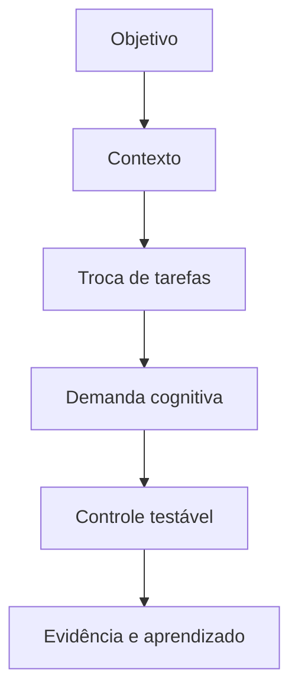
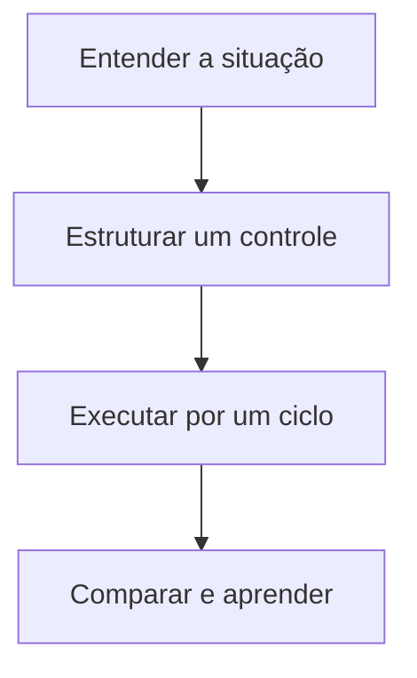

> **Frase-síntese:** Trocar rapidamente não significa trocar sem custo. — síntese a partir de Rogers e Monsell

## 1. Origem

**Termo.** Troca de tarefas.  
**Significado.** Condição da execução que merece observação e controle.  
**Etimologia.** Task switching significa troca de tarefa. Switch deriva do inglês para mudança ou desvio. No uso cognitivo, nomeia a reconfiguração entre regras e contextos, não apenas o clique entre telas.

## 2. Contexto

Durante um relatório, uma mensagem leva ao calendário e depois ao e-mail. Ao voltar, é preciso descobrir novamente onde continuar. O fator não caracteriza risco sozinho: precisa ser analisado com objetivo, contexto, vulnerabilidade, exposição e impacto.

## 3. 5W2H

| Variável | Síntese |
|---|---|
| O que? | Investigar troca de tarefas na execução real. |
| Por quê? | Reduzir demanda evitável e proteger o objetivo. |
| Onde? | Pessoa, tarefa, ambiente, processo ou tecnologia. |
| Quando? | Quando esforço, erro, espera ou retrabalho aumentarem. |
| Quem? | Executor, responsável pelo processo e projetista do sistema. |
| Como? | Observar sinais, testar controle e comparar resultado. |
| Quanto? | Um experimento pequeno por ciclo de execução. |

## 4. Referência padrão-ouro

Rogers e Monsell é usado como referência central deste framework porque a fonte associada documenta princípios ou achados diretamente aplicáveis ao fator. A centralidade vale para este recorte; não significa consenso exclusivo sobre todo o tema.

## 5. Problema existente

**Definição.** Cada troca pode exigir abandonar e reativar regras e contexto.  
**Identificação.** Aparece como esforço extra, atraso, erro, esquecimento, espera ou reconstrução.  
**Explicação.** A execução absorve uma demanda que poderia estar no desenho do sistema.  
**Fechamento.** A capacidade disponível deixa de servir integralmente ao objetivo.

## 6. Problema solucionado

**Definição.** A parte controlável do fator fica visível e recebe um experimento.  
**Identificação.** Reduzir trocas evitáveis e registrar um ponto de retomada.  
**Explicação.** O controle transfere demanda evitável para ambiente, processo ou tecnologia.  
**Fechamento.** O resultado passa a ser observado sem prometer eliminação do problema.

## 7. Processo

1. **Entender:** registrar situação, objetivo, sinais e impacto observável.
2. **Estruturar:** localizar o fator e escolher um controle pequeno e reversível.
3. **Executar:** aplicar o controle, comparar antes e depois e registrar aprendizado.

## 8. Visão do sistema

## 9. Progresso esperado

Antes, a pessoa sustenta parte do sistema mentalmente. Com um controle pequeno, observa menos reconstrução ou esforço evitável. Depois, a próxima ação, o estado e o critério ficam mais visíveis no cotidiano, sem afirmar resultado universal.

## 10. Aviso

Conteúdo educativo e operacional. Não diagnostica condição clínica nem transforma característica individual em risco. O efeito depende da pessoa, tarefa, ambiente e contexto.

## 11. Next 01-02-03

**Next 01 — Entender:** escolha uma situação real e descreva onde o esforço aparece.  
**Next 02 — Estruturar:** selecione um controle diretamente ligado ao fator observado.  
**Next 03 — Executar:** teste por um ciclo, compare sinais e registre o que mudou.

## 12. Fontes e aprofundamento

- [Costs of a predictable switch between simple cognitive tasks](https://doi.org/10.1037/0096-3445.124.2.207) — Rogers e Monsell, 1995.

## Relacionados

- [[Forma e visualização da informação]]
- [[Decomposição de tarefas]]
